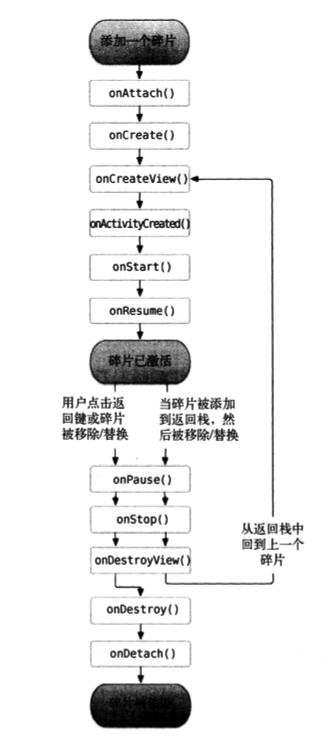

Android 的图形用户界面是由多个View 和 ViewGroup 构建出来的。View是通用的UI窗体小组件，比如按钮(Button) 或文本框(text field)，而ViewGroup是不可见的，是用于定义子View布局方式的容器，比如网格部件(grid)和垂直列表部件(list)。 


# 《第一行代码》学习笔记   
## Activity

1. 给主活动指定的label不仅会成为标题栏中的内容，还会成为启动器(Launcher)中应用程序显示的名称。
2. Activity 状态： 运行状态，暂停状态，停止状态，销毁状态.
3. **`Activity 生命周期`**：   

    - `onCreate()` 在第一次创建的时候被调用。 在此方法中应完成Activity的初始化操作，比如加载布局、绑定事件等等。
    - `onStart()` 在Activity 由不可见变为可见的时候调用。
    - `onResume()` 在Activity 准备好和用户进行交互的时候调用。此时Activity一定位于返回栈的栈顶，处于运行状态。
    - `onPause()` 在系统准备去启动或者恢复另一个Activity时调用。 `通常在这个方法中将一些消耗CPU的资源释放，以及保存一些关键数据`，但这个方法中的执行速度一定要快，不然会影响到新的栈顶Activity的使用。
    - `onStop()` 在Activity完全不可见的时候调用。它与`onPause()`的主要区别在于，如果新的Activity是一个对话框时，`onPause()`方法会得到执行，而`onStop()`并不会执行。
    - `onDestroy()` 在Activity被销毁之前调用，之后Activity的状态将变为销毁状态。
    - `onRestart()` 在Activity由停止状态变为运行状态之前调用，即Activity被重新启动。

    > 完整生存期：`onCreate()` ---> `onDestroy()` 之间所经历的，就是完整生存期。     
    > 可见生存期：`onStart()` ---> `onStop()` 之间所经历的，就是可见生存期。     
    > 前台生存期：`onResume()` ---> `onPause()` 之间所经历的，就是前台生存期。   

4. Activity 启动模式
    - `standard`
    - `singleTop` -- 当启动Activity时，如果发现返回栈的栈顶已经是该Activity，则会直接使用它，而不会再创建新的Activity实例。
    - `singleTask` -- 每次启动该活动时系统首先会在返回栈中检查是否存在该Activity的实例，如果发现已经存在则直接使用该实例，并把在这个活动之上的所有活动统统出栈，如果没有发现就会创建一个新的Activity实例。
    - `singleInstance` -- 会启动一个新的返回栈来管理这个Activity。
    
 
*Methods*

- `public boolean onCreateOptionsMenu(Menu menu)`   用于生成 menu

- `public boolean onOptionsItemSelected(MenuItem item)` 用于处理menu中的点击事件

- `protected void onActivityResult(int requestCode, int resultCode, Intent data)` 用于处理接受从其他Activity返回时带的数据

- `startActivityForResult` 用加载新的Activity，并能接受返回的数据

- `startActivity` 加载新的Activity

- `public void onBackPressed()` -- 当按手机的“返回”键时执行

- `finish()` -- 用于“杀”死当前Activity

- `protected void onSaveInstanceState(Bundle outState)` 在Activity被回收之前一定会被调用。

- `android.os.Process.killProcess(android.os.Process.myPid())` -- 用于杀掉当前进程，以保证程序完全退出， 此方法只能用于杀掉当前程序的进程，而`不能使用这个方法去杀掉其他程序`。

### *Fragment*(碎片)   

- 动态添加Fragment（碎片）步骤：

    > 1. 创建待添加的Fragment实例。
    > 2. 获取FragmentManager,在Activity中可以直接调用 getSupportFragmentManager() 方法得到。
    > 3. 开启一个事务， 通过调用 beginTransaction()方法。
    > 4. 向容器内添加或者替换 Fragment 碎片，一般使用replace()方法实现，需要传入容器的id和待添加的 Fragment 实例。
    > 5. 提交事务， 调用 commit() 方法。

    ```java
    //实例方法
    private void replaceFragment(Fragment fragment){
        FragmentManager fragmentManager = getSupportFragmentManager();
        FragmentTransaction transaction = fragmentManager.beginTransaction();
        transaction.replace(R.id.right_layout, fragment);
        //如果需要在Fragment中模拟返回栈，则加上如下一行代码即可。
        //transaction.addToBackStack(null);
        transaction.commit();
    }
    ```

- Activity 与 Fragment 通信

1. 在Activity 获取Fragment: 

    调用FragmentManager 的findFragmentById()方法，可以在Activity中获取Fragment实例。

    ```java
    RightFragment rightFragment = (RightFragment) getFragmentManager().findFragmentById(R.id.right_fragment);
    ```

2. 在 Fragment 中获取 Activity: 

    在Fragment中通过调用 getActivity() 来得到与当前Fragment相关联的Activity实例。
    
    ```java
    MainActivity activity =(MainActivity) getActivity();
    ```

3. Fragment 生命周期    

    - onAttach() - 当 Fragment 和 Activity 建立关系的时候调用。
    - onCreateView() - 为碎片创建视图（加载布局）时调用。
    - onActivityCreated() - 确保与 Fragment 相关联的 Activity 一定已经创建完毕的时候调用 。
    - onDestroyView() - 当与 Fragment 的视图被移除的时候调用。
    - onDetach() - 当 Fragment 与 Activity 解除关联的时候调用。

         

4. 动态加载布局的技巧    
 - 使用限定符

    按屏幕大小：  

    限定符|描述
    -:|-
     small | 提供给小屏幕设备的资源
     normal | 提供给中等屏幕设备的资源
     large | 提供给大屏幕设备的资源
     xlarge | 提供给超大屏幕设备的资源

     按屏幕分辨率:

     限定符|描述
        -:|-
    ldpi | 提供给低分辨率设备的资源(120dpi以下)
    mdpi | 提供给中等分辨率设备的资源(120dpi ~ 160dpi)
    hdpi | 提供给高分辨率设备的资源(160dpi ~ 240dpi)
    xhdpi | 提供给超高分辨率设备的资源(240dpi ~ 320dpi)
    xxhdpi | 提供给超超高分辨率设备的资源(320dpi ~ 480dpi)

    按屏幕方向:

    限定符|描述
        -:|-
    lang | 提供给横屏设备的资源
    port | 提供给竖屏设备的资源


 - 使用最小宽度限定符
    最小宽度限定符允许对屏幕的`宽度`指定一个最小值(以`dp`为单位)，以这个最小值为临界点，屏幕宽度大于等于这个值的设备就加载一个布局，屏幕宽度小于这个值的设备加载另一个布局。

    例如，在`res`目录下新建`layout-sw600dp` 文件夹，这就意味着当设备的屏幕宽度大于600dp时，会加载`layou-sw600dp`下的布局。


## Service
## Broadcast Receiver
1. 广播类型：
    - 标准广播(Normal broadcasts)
    - 有序广播(Ordered broadcasts)

2. 注册广播的方式：
    - 动态注册（代码中注册）
    - 静态注册（AndroidManifest.xml中注册）

3. 本地广播
    - 不能通过静态注册的方式进行。
    - 只会在本程序内能发送和接收，安全性高。
    - 使用 `LocalBroadcastManager` 对广播进行管理。

    ```java
    public class MainActivity extends AppCompatActivity {

        IntentFilter intentFilter;
        LocalReceiver localReceiver;
        LocalBroadcastManager localBroadcastManager ;

        @Override
        protected void onCreate(Bundle savedInstanceState) {
            super.onCreate(savedInstanceState);
            setContentView(R.layout.activity_main);

            Button button =(Button) findViewById(R.id.button);

            localBroadcastManager = LocalBroadcastManager.getInstance(this);

            button.setOnClickListener(new View.OnClickListener() {
                @Override
                public void onClick(View v) {
                    Intent intent = new Intent("com.example.mybroadcastreceiver.LOCAL_BROADCAST");
                    localBroadcastManager.sendBroadcast(intent);
                }
            });

            intentFilter = new IntentFilter();
            intentFilter.addAction("com.example.mybroadcastreceiver.LOCAL_BROADCAST");
            localReceiver = new LocalReceiver();
            localBroadcastManager.registerReceiver(localReceiver, intentFilter);
        }

        @Override
        protected void onDestroy() {
            super.onDestroy();
            localBroadcastManager.unregisterReceiver(localReceiver);
        }

        class LocalReceiver extends BroadcastReceiver{
            @Override
            public void onReceive(Context context, Intent intent) {
                Toast.makeText(context,"received local broadcast", Toast.LENGTH_SHORT).show();
            }
        }
    }
    ```

## Content Provider

主要用于在不同的应用程序之间实现数据共享的功能。

1. 在程序运行时申请权限
    例如 打电话权限：   
    ```java
    public class MainActivity extends AppCompatActivity {

        @Override
        protected void onCreate(Bundle savedInstanceState) {
            super.onCreate(savedInstanceState);
            setContentView(R.layout.activity_main);

            Button makeCall = (Button) findViewById(R.id.make_call);
            makeCall.setOnClickListener(new View.OnClickListener() {
                @Override
                public void onClick(View v) {
                    if (ContextCompat.checkSelfPermission(MainActivity.this, Manifest.permission.CALL_PHONE)
                            != PackageManager.PERMISSION_GRANTED){
                        ActivityCompat.requestPermissions(MainActivity.this, new String[]{Manifest.permission.CALL_PHONE},1);
                    }else
                    {
                        call();
                    }
                }
            });
        }

        @Override
        public void onRequestPermissionsResult(int requestCode, @NonNull String[] permissions, @NonNull int[] grantResults) {
            switch (requestCode){
                case 1:
                    if (grantResults.length > 0 && grantResults[0] == PackageManager.PERMISSION_GRANTED){
                        call();
                    }else{
                        Toast.makeText(this, "You denied the permission", Toast.LENGTH_SHORT).show();
                    }
                    break;
                default:
                    break;
            }
        }

        private void call(){
            Intent intent = new Intent(Intent.ACTION_CALL);
            intent.setData(Uri.parse("tel:10086"));
            try {
                startActivity(intent);
            }catch (SecurityException e){
                e.printStackTrace();
            }
        }
    }
    ```

2. [调用摄像头和相册 代码详例>>](./调用摄像头和相册.md)

3. [播放多媒体文件 代码详例>>](./播放多媒体文件.md) 

危险权限列表:
 

## [文件存储 详情>>](./持久化.md)


## build.gradle文件说明：    

    + `apply plugin: 'com.android.application'` -- 表示这是一个应用程序模块。
    + `apply plugin: 'com.android.library` -- 表示这是一个库模块。
    ```
    buildTypes {
        release {
            minifyEnabled false  # 表示是否要进行代码混淆
            proguardFiles getDefaultProguardFile('proguard-android.txt'), 'proguard-rules.pro'
        }
    }
    ```
    + Android Studio 项目一共有3种依赖方式：本地依赖、库依赖和远程依赖。

## Intent 
1. 显式 Intent

    例如：
    ```java
    Intent intent = new Intent(FirstActivity.this, SecondActivity.class);
    startActivity(intent);
    ```

2. 隐式 Intent

    指定一系列的action 和 category 等信息，然后交由系统去分析这个Intent， 并找出合适的活动去启动。

    例如：  只有当Intent中的设置与`intent-filter`标签中的设置一致时，`ThirdActivity`才能够响应Intent。
    ```xml
    <activity android:name=".ThirdActivity" android:label="Third Activity">
            <intent-filter>
                <action android:name="android.intent.action.VIEW"/>
                <category android:name="android.intent.category.DEFAULT"/>
                <data android:scheme="http"/>
            </intent-filter>
        </activity>
    ```


# 布局
## *LinearLayout*  
LinearLayout是***ViewGroup***的一个子类，用于放置水平或者垂直方向的子视图部件，放置方向由属性***android:orientation***设定。LinearLayout里的子布局按照XML里定义的顺序显示在屏幕上。     

- android:hint  
当文本框为空的时候,会默认显示这个字符串    
- android:layout_weight     
***权重***的值指的是每个部件所占剩余空间的大小，该值与同级部件所占空间大小有关。就类似于饮料的成分配方：“两份伏特加酒，一份咖啡利口酒”，即该酒中伏特加酒占三分之二。例如，我们设置一个View的权重是2，另一个View的权重是1，那么总数就是3，这时第一个View占据2/3的空间，第二个占据1/3的空间。如果你再加入第三个View，权重设为1，那么第一个View(权重为2的)会占据1/2的空间，剩余的另外两个View各占1/4。(请注意，使用权重的前提一般是给View的宽或者高的大小设置为0dp，然后系统根据上面的权重规则来计算View应该占据的空间。但是很多情况下，如果给View设置了match_parent的属性，那么上面计算权重时则不是通常的正比，而是反比，也就是权重值大的反而占据空间小)。      
对于所有的View默认的权重是0，如果只设置了一个View的权重大于0，则该View将占据除去别的View本身占据的空间的所有剩余空间。    
**为了提升布局的效率，在设置权重的时候，应该把EditText的宽度设为0dp。**    

- **`android:layout_gravity`** & **`android:gravity`**  

    + android:layout_gravity -- 用于指定控件在布局中的对齐方式。    
        `当LinearLayout 的排列方向是horizontal时，只有垂直方向上的对齐方式才会生效；当LinearLayout的排列方向是vertical时，只有水平方向上的对齐方式才会生效。`
    + android:gravity -- 用于指定文字在控件中的对齐方式。

## *RelativeLayout*   

android:layout_alignParentLeft  
android:layout_alignParentTop   
android:layout_alignParentRight     
android:layout_alignParentBottom    
`android:layout_centerInparent`   
android:layout_above   
android:layout_below    
android:layout_toLeftOf     
android:layout_toRightOf    
`android:layout_alignLeft`        
*android:layout_alignRight*       
*android:layout_alignTop*     
*android:layout_alignBottom*     

## *FrameLayout* 帧布局

## 百分比布局 *PercentFrameLayout* & *PercentRelativeLayout* 
百分比布局属于新增布局，在保证所有Android系统版本都兼容百分比布局，需要做如下设置：

在app/build.gradle文件中，添加如下设置：
```gradle
dependencies{
    compile 'com.android.support.percent:24.2.1'  #具体的数字可能需要根据情况进行修改
}
```

`xmlns:app="http://schemas.android.com/apk/res-auto`

使用如下两个属性对控件大小进行控制
- `app:layout_widthPercent`
- `app:layout_heightPercent`

借用`android:layout_gravity`对控件的位置进行控制


# 使用***ProGuard***混淆代码。
# 


1. 隐藏系统自带的标题栏   
```java
import android.support.v7.app.ActionBar;

ActionBar actionBar = getSupportActionBar();//获取系统的标题栏对象
if (actionBar != null){
    actionBar.hide();
}
```

2. *ArrayAdapter< T >* 用法实例
```java
FruitAdapter adapter = new FruitAdapter(MainActivity.this, R.layout.fruit_item, fruitList);


public class FruitAdapter extends ArrayAdapter<Fruit> {

    //item 的 layout ID
    private int resourceId;

    public FruitAdapter(@NonNull Context context, @LayoutRes int resource, @NonNull List<Fruit> objects) {
        super(context, resource, objects);
        resourceId = resource;
    }

    @NonNull
    @Override
    public View getView(int position, @Nullable View convertView, @NonNull ViewGroup parent) {
        Fruit fruit = getItem(position);
        View view;
        ViewHolder viewHolder;
        if (convertView == null) {//当系统中没有缓存View时
            view = LayoutInflater.from(getContext()).inflate(resourceId, parent, false);//标准写法
            viewHolder = new ViewHolder();
            viewHolder.fruitImage = (ImageView) view.findViewById(R.id.fruit_image);
            viewHolder.fruitName = (TextView) view.findViewById(R.id.fruit_name);

            view.setTag(viewHolder);
        }else{
            view = convertView;
            viewHolder = (ViewHolder) view.getTag();
        }

        viewHolder.fruitImage.setImageResource(fruit.getImageId());
        viewHolder.fruitName.setText(fruit.getName());

        return view;
    }

    class ViewHolder{
        ImageView fruitImage;
        TextView fruitName;
    }
}
```

3. *RecyclerView* [用法>>](./recyclerview.md)    
RecyclerView 属于新增的控件。需要手动添加设置:  
在app/build.gradle文件中，进行如下设置：    
    ```gradle
    dependencies{
        compile 'com.android.support:recyclerview-v7:25.2.0' #数字可能会有所不同。
    }
    ``` 


4. draw9patch  9-patch  点9图片文件  

    在图片的四个边框绘制一个个的小黑点， 在上边框 和左边框 绘制的部分表示当图片需要拉伸时就拉伸黑点标记的区域， 在下边框 和 右边框 绘制的部分表示内容会被放置的区域。
