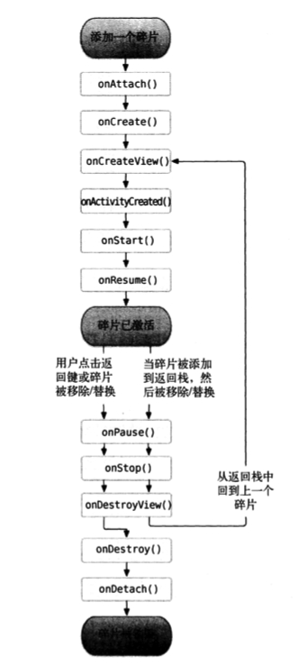

- <div id="fragment_dongtai_code">动态添加Fragment（碎片）步骤</div>：

    > 1. 创建待添加的Fragment实例。
    > 2. 获取FragmentManager,在Activity中可以直接调用 getSupportFragmentManager() 方法得到。
    > 3. 开启一个事务， 通过调用 beginTransaction()方法。
    > 4. 向容器内添加或者替换 Fragment 碎片，一般使用replace()方法实现，需要传入容器的id和待添加的 Fragment 实例。
    > 5. 提交事务， 调用 commit() 方法。

```java
//实例方法
private void replaceFragment(Fragment fragment){
    FragmentManager fragmentManager = getSupportFragmentManager();
    FragmentTransaction transaction = fragmentManager.beginTransaction();
    transaction.replace(R.id.right_layout, fragment);
    //如果需要在Fragment中模拟返回栈，则加上如下一行代码即可。
    //transaction.addToBackStack(null);
    transaction.commit();
}
```

- Activity 与 Fragment 通信

1. 在Activity 获取Fragment: 

    调用FragmentManager 的findFragmentById()方法，可以在Activity中获取Fragment实例。

    ```java
    RightFragment rightFragment = (RightFragment) getFragmentManager().findFragmentById(R.id.right_fragment);
    ```

2. 在 Fragment 中获取 Activity: 

    在Fragment中通过调用 getActivity() 来得到与当前Fragment相关联的Activity实例。
    
    ```java
    MainActivity activity =(MainActivity) getActivity();
    ```

3. Fragment 生命周期    

    - onAttach() - 当 Fragment 和 Activity 建立关系的时候调用。
    - onCreateView() - 为碎片创建视图（加载布局）时调用。
    - onActivityCreated() - 确保与 Fragment 相关联的 Activity 一定已经创建完毕的时候调用 。
    - onDestroyView() - 当与 Fragment 的视图被移除的时候调用。
    - onDetach() - 当 Fragment 与 Activity 解除关联的时候调用。

         

4. 动态加载布局的技巧    
 - 使用限定符

    按屏幕大小：  

    限定符|描述
    -:|-
     small | 提供给小屏幕设备的资源
     normal | 提供给中等屏幕设备的资源
     large | 提供给大屏幕设备的资源
     xlarge | 提供给超大屏幕设备的资源

     按屏幕分辨率:

     限定符|描述
        -:|-
    ldpi | 提供给低分辨率设备的资源(120dpi以下)
    mdpi | 提供给中等分辨率设备的资源(120dpi ~ 160dpi)
    hdpi | 提供给高分辨率设备的资源(160dpi ~ 240dpi)
    xhdpi | 提供给超高分辨率设备的资源(240dpi ~ 320dpi)
    xxhdpi | 提供给超超高分辨率设备的资源(320dpi ~ 480dpi)

    按屏幕方向:

    限定符|描述
        -:|-
    lang | 提供给横屏设备的资源
    port | 提供给竖屏设备的资源


 - 使用最小宽度限定符
    最小宽度限定符允许对屏幕的`宽度`指定一个最小值(以`dp`为单位)，以这个最小值为临界点，屏幕宽度大于等于这个值的设备就加载一个布局，屏幕宽度小于这个值的设备加载另一个布局。

    例如，在`res`目录下新建`layout-sw600dp` 文件夹，这就意味着当设备的屏幕宽度大于600dp时，会加载`layou-sw600dp`下的布局。