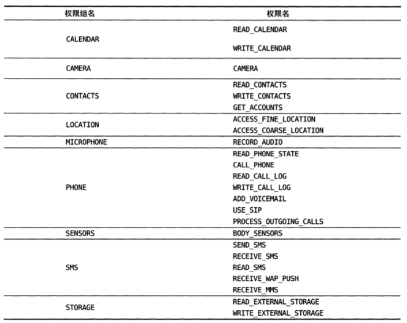

Android 的图形用户界面是由多个View 和 ViewGroup 构建出来的。View是通用的UI窗体小组件，比如按钮(Button) 或文本框(text field)，而ViewGroup是不可见的，是用于定义子View布局方式的容器，比如网格部件(grid)和垂直列表部件(list)。 

# 四大组件：

1. [Activity >>](./Activity.md)

    [Fragment(碎片) >>](./Fragment.md)   

    [Intent >>](./Intent.md) 
2. Service
3. [Broadcast Receiver >>](./Broadcast_Receiver.md)
4. [Content Provider >>](./Content_Provider.md)

# Material Design
+ Toolbar
+ DrawerLayout
+ NavigationView
+ FloatingActionButton
+ Snackbar
+ CoordinatorLayout
+ CardView
+ AppBarLayout
+ SwipeRefreshLayout
+ CollapsingToolbarLayout
+ NestedScrollView


# 代码实例：

+ [调用摄像头和相册 代码详例>>](./tools_codes/调用摄像头和相册.md)

+ [播放多媒体文件 代码详例>>](./tools_codes/播放多媒体文件.md) 

+ [用于进行调试用的日志工具类 LogUtil 代码>>](./tools_codes/LogUtil.md)

+ 打电话功能：   
    ```java
    button1.setOnClickListener(new View.OnClickListener() {
            @Override
            public void onClick(View v) {
                Intent intent = new Intent(Intent.ACTION_DIAL);
                intent.setData(Uri.parse("tel:10086"));
                startActivity(intent);
            }
        });
    ```

+ [返回数据给上一个Activity](./Intent.md#startActivityForResult)

+ [AlertDialog 使用>>](./tools_codes/toolcodes.md#alertdialog_code)

+ [ProgressDialog 使用>>](./tools_codes/toolcodes.md#progressdialog_code)

+ [隐藏掉系统自带的标题栏 `ActionBar` >>](./tools_codes/toolcodes.md#hide_actionbar_code)

+ [`ArrayAdapter<T>` 用法实例 >>](./tools_codes/toolcodes.md#array_adapter_code)

+ [`RecyclerView` 用法实例>>](./recyclerview.md) 

+ [动态添加 `Fragment`（碎片） >> ](./Fragment.md#fragment_dongtai_code)

+ [读取手机联系人 >>](./tools_codes/toolcodes.md#read_contacts_code)

危险权限列表:
 

## [文件存储 详情>>](./持久化.md)


## [build.gradle文件说明 >>](./build.gradle.md)  

# [布局 >>](.\布局.md)

# 使用***ProGuard***混淆代码。


#
 

4. draw9patch  9-patch  点9图片文件  

    在图片的四个边框绘制一个个的小黑点， 在上边框 和左边框 绘制的部分表示当图片需要拉伸时就拉伸黑点标记的区域， 在下边框 和 右边框 绘制的部分表示内容会被放置的区域。


# Tools
+ [LitePal 操作SQLite](https://github.com/LitePalFramework/LitePal.git)
+ [GSON 操作Json](https://github.com/google/gson)
+ [CircleImageView 实现图片圆形化](https://github.com/hdodenhof/CircleImageView)
+ [Glide 图片加载库](https://github.com/bumptech/glide)