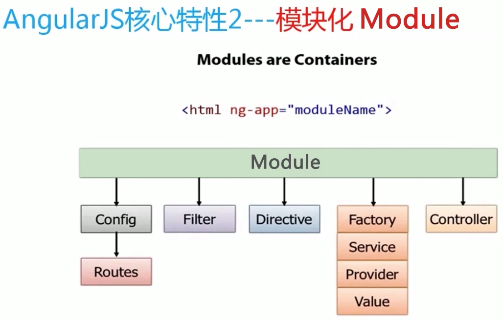
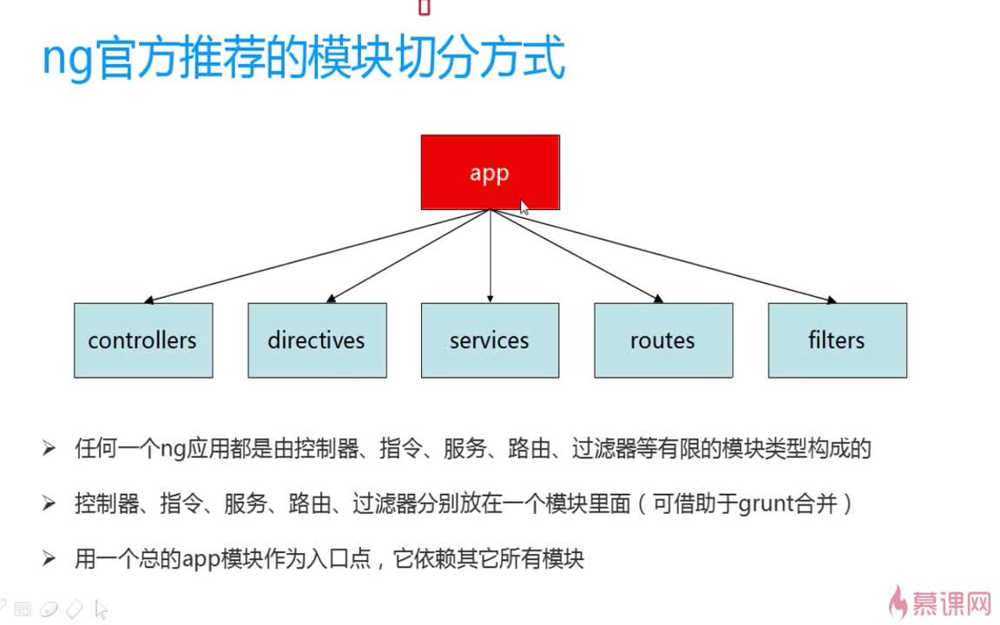

[Angular API reference](http://docs.ngnice.com/api)

# 四大核心特性
1. MVC
2. 模块化 *以模块为中心*
  
------
  
3. 指令系统
4. 双向数据绑定

# 路由
- $routeProvider指令  
$routeProvider 中主要是两个方***when*** 和 ***otherwise*** 。
```html
$routeProvider.when('/hello',{
    templateUrl: 'templates/hello.html',
    controller: 'HelloCtrl'
})when('/list',{
    templateUrl: 'templates/list.html',
    controller: 'ListCtrl'
}).otherwise({
    redirectTo: '/hello'
});
```

# AngularJS 表达式
1. AngularJS 表达式写在双大括号内：{{ expression }}。
2. AngularJS 表达式把数据绑定到 HTML，这与 ng-bind 指令有异曲同工之妙。
3. AngularJS 将在表达式书写的位置"输出"数据。
4. AngularJS 表达式 很像 JavaScript 表达式：它们可以包含文字、运算符和变量。

#### AngularJS 数字     
```html
<div ng-app="" ng-init="quantity=1;cost=5">
<p>总价： {{ quantity * cost }}</p>
</div>
```     
    使用 ng-bind 的相同实例：   
```html
<div ng-app="" ng-init="quantity=1;cost=5">
<p>总价： <span ng-bind="quantity * cost"></span></p>
</div> 
```

#### AngularJS 字符串
```html
<div ng-app="" ng-init="firstName='John';lastName='Doe'">
<p>姓名： {{ firstName + " " + lastName }}</p>
</div>
```
    使用 ng-bind 的相同实例：
```html
<div ng-app="" ng-init="firstName='John';lastName='Doe'">
<p>姓名： <span ng-bind="firstName + ' ' + lastName"></span></p>
</div>
```

#### AngularJS 对象
```html
<div ng-app="" ng-init="person={firstName:'John',lastName:'Doe'}">

<p>姓为 {{ person.lastName }}</p>

</div>
```
    使用 ng-bind 的相同实例：
```html
<div ng-app="" ng-init="person={firstName:'John',lastName:'Doe'}">

<p>姓为 <span ng-bind="person.lastName"></span></p>

</div>
```
#### AngularJS 数组
```html
<div ng-app="" ng-init="points=[1,15,19,2,40]">

<p>第三个值为 {{ points[2] }}</p>

</div>
```
    使用 ng-bind 的相同实例：
```html
<div ng-app="" ng-init="points=[1,15,19,2,40]">

<p>第三个值为 <span ng-bind="points[2]"></span></p>

</div>
```
    - 类似于 JavaScript 表达式，AngularJS 表达式可以包含字母，操作符，变量。        
    - 与 JavaScript 表达式不同，AngularJS 表达式可以写在 HTML 中。        
    - 与 JavaScript 表达式不同，AngularJS 表达式不支持条件判断，循环及异常。      
    - 与 JavaScript 表达式不同，AngularJS 表达式支持过滤器。      

# AngularJS 指令
1. AngularJS 通过被称为 指令 的新属性来扩展 HTML。
2. AngularJS 通过内置的指令来为应用添加功能。
3. AngularJS 允许你自定义指令。
4. AngularJS 指令是扩展的 HTML 属性，带有前缀 ng-。   
    > ng-app 指令初始化一个 AngularJS 应用程序。  
    > ng-init 指令初始化应用程序数据。    
    > ng-model 指令把元素值（比如输入域的值）绑定到应用程序。  

[AngularJS 参考手册](http://www.runoob.com/angularjs/angularjs-reference.html) 
```html
<div ng-app="" ng-init="firstName='John'">
<!-- ng-app 指令告诉 AngularJS，<div> 元素是 AngularJS 应用程序 的"所有者"。 -->
  <p>在输入框中尝试输入：</p>
  <p>姓名：<input type="text" ng-model="firstName"></p>
  <p>你输入的为： {{ firstName }}</p>
</div>
```
一个网页可以包含多个运行在不同元素中的 AngularJS 应用程序。     
#### 数据绑定
    AngularJS 中的数据绑定，同步了 AngularJS 表达式与 AngularJS 数据。   
    {{ firstName }} 是通过 ng-model="firstName" 进行同步。
```html
<div ng-app="" ng-init="quantity=1;price=5">

<h2>价格计算器</h2>

数量： <input type="number" ng-model="quantity">
价格： <input type="number" ng-model="price">
<p><b>总价：</b> {{ quantity * price }}</p>
</div>
```

#### 重复 HTML 元素 
***ng-repeat*** 指令对于集合中（数组中）的每个项会 克隆一次 HTML 元素。     
***ng-repeat*** 指令会重复一个 HTML 元素：
```html
<div ng-app="" ng-init="names=['Jani','Hege','Kai']">
  <p>使用 ng-repeat 来循环数组,从而在页面上生成多个li</p>
  <ul>
    <li ng-repeat="x in names">
      {{ x }}
    </li>
  </ul>
</div>
```
***ng-repeat*** 指令用在一个对象数组上：
```html
<div ng-app="" ng-init="names=[
{name:'Jani',country:'Norway'},
{name:'Hege',country:'Sweden'},
{name:'Kai',country:'Denmark'}]">

<p>循环对象：</p>
<ul>
  <li ng-repeat="x in names">
    {{ x.name + ', ' + x.country }}
  </li>
</ul>
</div>
```
#### ng-app 指令
1. ng-app 指令定义了 AngularJS 应用程序的 根元素。   
2. ng-app 指令在网页加载完毕时会自动引导（自动初始化）应用程序。 

#### ng-model 指令
ng-model 指令 绑定 HTML 元素 到应用程序数据。
ng-model 指令也可以： 
> 为应用程序数据提供类型验证（number、email、required）。     
> 为应用程序数据提供状态（invalid、dirty、touched、error)。       
> 为 HTML 元素提供 CSS 类。    
> 绑定 HTML 元素到 HTML 表单。      

#### 创建自定义的指令
使用 .directive 函数来添加自定义的指令。  
要调用自定义指令，HTML 元素上需要添加自定义指令名。        

    使用驼峰法来命名一个指令， runoobDirective, 但在使用它时需要以 - 分割, runoob-directive:
```html
<body ng-app="myApp">
<runoob-directive></runoob-directive>
<script>
var app = angular.module("myApp", []);
app.directive("runoobDirective", function() {
    return {
        template : "<h1>自定义指令!</h1>"
    };
});
</script>
</body>
```
- 通过***元素名***调用
```html
<!DOCTYPE html>
<html>
<head>
<meta charset="utf-8">
<script src="http://apps.bdimg.com/libs/angular.js/1.4.6/angular.min.js"></script> 
</head> 
<body ng-app="myApp">
<runoob-directive></runoob-directive>
<script>
var app = angular.module("myApp", []);
app.directive("runoobDirective", function() {
    return {
        template : "<h1>自定义指令!</h1>"
    };
});
</script>
</body>
</html>
```
- 通过***属性***调用
```html
<!DOCTYPE html>
<html>
<head>
<meta charset="utf-8">
<script src="http://apps.bdimg.com/libs/angular.js/1.4.6/angular.min.js"></script> 
</head>
<body ng-app="myApp">
<div runoob-directive></div>
<script>
var app = angular.module("myApp", []);
app.directive("runoobDirective", function() {
    return {
        template : "<h1>自定义指令!</h1>"
    };
});
</script>
</body>
</html>
```
- 通过***类名***调用
```html
<!DOCTYPE html>
<html>
<head>
<meta charset="utf-8">
<script src="http://apps.bdimg.com/libs/angular.js/1.4.6/angular.min.js"></script> 
</head>
<body ng-app="myApp">
<div class="runoob-directive"></div>
<script>
var app = angular.module("myApp", []);
app.directive("runoobDirective", function() {
    return {
        restrict : "C",
        template : "<h1>自定义指令!</h1>"
    };
});
</script>
<p><strong>注意：</strong> 你必须设置 <b>restrict</b> 的值为 "C" 才能通过类名来调用指令。</p>
</body>
</html>
```
- 通过***注释***调用
```html
<!DOCTYPE html>
<html>
<head>
<meta charset="utf-8">
<script src="http://apps.bdimg.com/libs/angular.js/1.4.6/angular.min.js"></script> 
</head>
<body ng-app="myApp">
<!-- directive: runoob-directive -->
<script>
var app = angular.module("myApp", []);
app.directive("runoobDirective", function() {
    return {
        restrict : "M",
        replace : true,
        template : "<h1>自定义指令!</h1>"
    };
});
</script>
<p><strong>注意：</strong> 我们需要在该实例添加 <strong>replace</strong> 属性， 否则评论是不可见的。</p>
<p><strong>注意：</strong> 你必须设置 <b>restrict</b> 的值为 "M" 才能通过注释来调用指令。</p>
</body>
</html>
```
#### 限制使用
    通过添加 ***restrict*** 属性,来设置指令只能通过特定的方式来调用:  
    restrict 默认值为 EA, 即可以通过元素名和属性名来调用指令。    
    ***restrict*** 值可以是以下几种:
    > E 只限元素名使用     
    > A 只限属性使用      
    > C 只限类名使用      
    > M 只限注释使用      

可以通过transclude=true来做到嵌套：
```html
var myModule = angular.model("myApp"[]);
myModule.directive("hello",function(){
    return {
        restrict: "AE",
        transclude: true,
        template:"<div>Hello Angular <div ng-transclude></div></div>"
    }
});
<!--
使用如下两句，就可以对“hello”中的嵌套html进行显示了。
transclude: true,
template:"<div>Hello Angular <div ng-transclude></div></div>"
如下使用方式：
<hello>
<div>这是一个嵌套子句</div>
</hello>
 -->
```

#### 在指令中使用 ***link*** 可以给指令中的元素绑定事件和属性
```html
<!--
定义了两个controller，在每个中使用了自定义的标签hello，
通过howtoload来实现不同的事件执行。
-->
<body ng-app="myApp">
<div ng-controller="ctl1">
    <hello howtoload="loadData()"></hello>
</div>
<div ng-controller="ctl2">
    <hello howtoload="loadData2()"></hello>
</div>
</body>
```

```javascript
var myModule = angular.model("myApp"[]);
myModule.controller("ctl1",["$scope",function($scope){
    $scope.loadData = function(){
        console.log("ctl1 load data.");
    }
}]);
myModule.controller("ctl2",["$scope",function($scope){
    $scope.loadData2 = function(){
        console.log("ctl2 load data.");
    }
}]);
myModule.directive("hello",function(){
    return {
        restrict: "AE",
        transclude: true,
        template:"<div>Hello Angular <div ng-transclude></div></div>",
        link:function(scope, element, attrs) {
            element.bind('mouseenter', function(event){
                scope.$apply(attrs.howtoload);
            });
        }
    }
});
```

# ***ng-model*** 指令

***ng-model*** 指令用于绑定应用程序数据到 HTML 控制器(input, select, textarea)的值。   
1. ng-model 指令可以将输入域的值与 AngularJS 创建的变量绑定。

```html
<div ng-app="myApp" ng-controller="myCtrl">
    名字: <input ng-model="name">
</div>
<script>
var app = angular.module('myApp', []);
app.controller('myCtrl', function($scope) {
    $scope.name = "John Doe";
});
</script>
```

2. 双向绑定, 双向绑定，在修改输入域的值时， AngularJS 属性的值也将修改：

```html
<div ng-app="myApp" ng-controller="myCtrl">
    名字: <input ng-model="name">
    <h1>你输入了: {{name}}</h1>
</div>
```

3. 验证用户输入

```html
<form ng-app="" name="myForm">
    Email:
    <input type="email" name="myAddress" ng-model="text">
    <span ng-show="myForm.myAddress.$error.email">不是一个合法的邮箱地址</span>
    <!-- 提示信息会在 ng-show 属性返回 true 的情况下显示 -->
</form>
```

4. 应用状态

```html
<form ng-app="" name="myForm" ng-init="myText = 'test@runoob.com'">
Email:
<input type="email" name="myAddress" ng-model="myText" required>
<p>编辑邮箱地址，查看状态的改变。</p>
<h1>状态</h1>
<p>Valid: {{myForm.myAddress.$valid}} (如果输入的值是合法的则为 true)。</p>
<p>Dirty: {{myForm.myAddress.$dirty}} (如果值改变则为 true)。</p>
<p>Touched: {{myForm.myAddress.$touched}} (如果通过触屏点击则为 true)。</p>
</form>
```

5. CSS 类 , ng-model 指令基于它们的状态为 HTML 元素提供了 CSS 类：

```html
<style>
input.ng-invalid {
    background-color: lightblue;
}
</style>
<body>
<form ng-app="" name="myForm">
    输入你的名字:
    <input name="myAddress" ng-model="text" required>
</form>
```

# AngularJS Scope(作用域)

***scope*** 是模型。scope 是一个 JavaScript 对象，带有属性和方法，这些属性和方法可以在视图和控制器中使用。
- Scope(作用域) 是应用在 HTML (视图) 和 JavaScript (控制器)之间的纽带。
- Scope 是一个对象，有可用的方法和属性。
- Scope 可应用在视图和控制器上。        

当你在 AngularJS 创建控制器时，你可以将 $scope 对象当作一个参数传递:

```html
<div ng-app="myApp" ng-controller="myCtrl">
<h1>{{carname}}</h1>
</div>
<!-- 当在控制器中添加 $scope 对象时，视图 (HTML) 可以获取了这些属性。
视图中，你不需要添加 $scope 前缀, 只需要添加属性名即可，如： {{carname}}。
-->
<script>
var app = angular.module('myApp', []);
app.controller('myCtrl', function($scope) {
    $scope.carname = "Volvo";
});
</script>
```

```html
<div ng-app="myApp" ng-controller="myCtrl">
<input ng-model="name">
<h1>我的名字是 {{name}}</h1>
</div>
<script>
var app = angular.module('myApp', []);
app.controller('myCtrl', function($scope) {
    $scope.name = "John Dow";
});
</script>
```

#### 根作用域

所有的应用都有一个 ***$rootScope***，它可以作用在 ng-app 指令包含的所有 HTML 元素中。
$rootScope 可作用于整个应用中。是各个 controller 中 scope 的桥梁。用 rootscope 定义的值，可以在各个 controller 中使用。      

```html
<div ng-app="myApp" ng-controller="myCtrl">
    <h1>{{lastname}} 家族成员:</h1>
    <ul>
        <li ng-repeat="x in names">{{x}} {{lastname}}</li>
    </ul>
</div> 
```

```javascript
var app = angular.module('myApp', []);
app.controller('myCtrl', function($scope, $rootScope) {
    $scope.names = ["Emil", "Tobias", "Linus"];
    $rootScope.lastname = "Refsnes";
});     
```

# AngularJS 控制器

- AngularJS 控制器 控制 AngularJS 应用程序的数据。
- AngularJS 控制器是常规的 JavaScript 对象。
- AngularJS 应用程序被控制器控制。
- ****ng-controller**** 指令定义了应用程序控制器。
- 控制器是 JavaScript 对象，由标准的 JavaScript 对象的构造函数 创建。    

    ```html
    <div ng-app="myApp" ng-controller="myCtrl">
    名: <input type="text" ng-model="firstName"><br>
    姓: <input type="text" ng-model="lastName"><br>
    <br>
    姓名: {{firstName + " " + lastName}}
    </div>
    ```

    ```javascript 
    var app = angular.module('myApp', []);
    app.controller('myCtrl', function($scope) {
        $scope.firstName = "John";
        $scope.lastName = "Doe";
    }); 
    ```

    控制器也可以有方法（变量和函数）：

    ```html
    <div ng-app="myApp" ng-controller="personCtrl">
    名: <input type="text" ng-model="firstName"><br>
    姓: <input type="text" ng-model="lastName"><br>
    <br>
    姓名: {{fullName()}}
    </div>
    <script>
    ```

    ```javascript
    var app = angular.module('myApp', []);
    app.controller('personCtrl', function($scope) {
        $scope.firstName = "John";
        $scope.lastName = "Doe";
        $scope.fullName = function() {
            return $scope.firstName + " " + $scope.lastName;
        }
    });
    </script>
    ```

    外部文件中的控制器

    ```html
    <div ng-app="myApp" ng-controller="namesCtrl">
    <ul>
    <li ng-repeat="x in names">
        {{ x.name + ', ' + x.country }}
    </li>
    </ul>
    </div>
    <script src="namesController.js"></script>
    ```

    ```javascript
    //外部js文件：namesController.js
    angular.module('myApp', []).controller('namesCtrl', function($scope) {
        $scope.names = [
            {name:'Jani',country:'Norway'},
            {name:'Hege',country:'Sweden'},
            {name:'Kai',country:'Denmark'}
        ];
    });
    ```

# AngularJS 过滤器

- 过滤器可以使用一个管道字符（|）添加到表达式和指令中。     
- 表达式中添加过滤器     
- 过滤器可以通过一个管道字符（|）和一个过滤器添加到表达式中。

    ```html
    <!-- uppercase 过滤器将字符串格式化为大写 -->
    <div ng-app="myApp" ng-controller="personCtrl">
    <p>姓名为 {{ lastName | uppercase }}</p>
    </div>
    ```

    ```html
    <!-- lowercase 过滤器将字符串格式化为小写：-->
    <div ng-app="myApp" ng-controller="personCtrl">
    <p>姓名为 {{ lastName | lowercase }}</p>
    </div>
    ```

    ```html
    <!-- currency 过滤器将数字格式化为货币格式：-->
    <div ng-app="myApp" ng-controller="costCtrl">
    <input type="number" ng-model="quantity">
    <input type="number" ng-model="price">
    <p>总价 = {{ (quantity * price) | currency }}</p>
    </div>
    ```

- 向指令添加过滤器      
过滤器可以通过一个管道字符（|）和一个过滤器添加到指令中。

    ```html
    <!-- orderBy 过滤器根据表达式排列数组： -->
    <div ng-app="myApp" ng-controller="namesCtrl">
    <ul>
    <li ng-repeat="x in names | orderBy:'country'">
        {{ x.name + ', ' + x.country }}
    </li>
    </ul>
    <div>
    ```

- 过滤输入      
输入过滤器可以通过一个管道字符（|）和一个过滤器添加到指令中，该过滤器后跟一个冒号和一个模型名称。

    ```html
    <!-- filter 过滤器从数组中选择一个子集：-->
    <div ng-app="myApp" ng-controller="namesCtrl">
    <p><input type="text" ng-model="test"></p>
    <ul>
    <li ng-repeat="x in names | filter:test | orderBy:'country'">
        {{ (x.name | uppercase) + ', ' + x.country }}
    </li>
    </ul>
    </div>
    ```

|*过滤器*              |*描述*                      |  
|--------------------------:|:-------------------------|
|currency           |   格式化数字为货币格式。       |    
|filter             |   从数组项中选择一个子集。      |     
|lowercase          |   格式化字符串为小写。         |   
|orderBy            |   根据某个表达式排列数组。      | 
|uppercase          |   格式化字符串为大写。         |


# AngularJS 服务(Service)
在 AngularJS 中，服务是一个函数或对象，可在你的 AngularJS 应用中使用。AngularJS 内建了30 多个服务。      
AngularJS 会一直监控应用，处理事件变化， AngularJS 使用 $location 服务比使用 window.location 对象更好。    
```html
<!-- 注意 $location 服务是作为一个参数传递到 controller 中。如果要使用它，需要在 controller 中定义。-->
<div ng-app="myApp" ng-controller="myCtrl">
<p> 当前页面的url:</p>
<h3>{{myUrl}}</h3>
</div>
<p>该实例使用了内建的 $location 服务获取当前页面的 URL。</p>
<script>
var app = angular.module('myApp', []);
app.controller('myCtrl', function($scope, $location) {
    $scope.myUrl = $location.absUrl();
});
</script>
```

#### $http 服务
$http 是 AngularJS 应用中最常用的服务。 服务向服务器发送请求，应用响应服务器传送过来的数据。
```html
<div ng-app="myApp" ng-controller="myCtrl"> 
<p>欢迎信息:</p>
<h1>{{myWelcome}}</h1>
</div>
<p> $http 服务向服务器请求信息，返回的值放入变量 "myWelcome" 中。</p>
<script>
var app = angular.module('myApp', []);
app.controller('myCtrl', function($scope, $http) {
  $http.get("welcome.htm").then(function (response) {
      $scope.myWelcome = response.data;
  });
});
</script>
```
```html
<div ng-app="myApp" ng-controller="customersCtrl"> 
<ul>
  <li ng-repeat="x in names">
    {{ x.Name + ', ' + x.Country }}
  </li>
</ul>
</div>

<script>
var app = angular.module('myApp', []);
app.controller('customersCtrl', function($scope, $http) {
  $http.get("服务器地址，返回数据为JSON格式")
  .success(function (response) {$scope.names = response.records;});
});
</script>
```

#### $timeout 服务
AngularJS $timeout 服务对应了 JS window.setTimeout 函数。
```html
<div ng-app="myApp" ng-controller="myCtrl"> 
<p>两秒后显示信息:</p>
<h1>{{myHeader}}</h1>
</div>
<p>$timeout 访问在规定的毫秒数后执行指定函数。</p>
<script>
var app = angular.module('myApp', []);
app.controller('myCtrl', function($scope, $timeout) {
  $scope.myHeader = "Hello World!";
  $timeout(function () {
      $scope.myHeader = "How are you today?";
  }, 2000);
});
</script>
```

#### $interval 服务
AngularJS $interval 服务对应了 JS window.setInterval 函数。
```html
<div ng-app="myApp" ng-controller="myCtrl"> 
<p>现在时间是:</p>
<h1>{{theTime}}</h1>
</div>
<p>$interval 访问在指定的周期(以毫秒计)来调用函数或计算表达式。</p>
<script>
var app = angular.module('myApp', []);
app.controller('myCtrl', function($scope, $interval) {
  $scope.theTime = new Date().toLocaleTimeString();
  $interval(function () {
      $scope.theTime = new Date().toLocaleTimeString();
  }, 1000);
});
</script>
```

#### 创建自定义服务
```html
<!-- 使用自定义的的服务 hexafy 将一个数字转换为16进制数: -->
<div ng-app="myApp" ng-controller="myCtrl">
<p>255 的16进制是:</p>
<h1>{{hex}}</h1>
</div>
<p>自定义服务，用于转换16进制数：</p>
<script>
var app = angular.module('myApp', []);
app.service('hexafy', function() {
	this.myFunc = function (x) {
        return x.toString(16);
    }
});
app.controller('myCtrl', function($scope, hexafy) {
  $scope.hex = hexafy.myFunc(255);
});
</script>
```
```html
<div ng-app="myApp">
<!-- 在过滤器中使用服务:-->
<h1>{{255 | myFormat}}</h1>
</div>
<script>
var app = angular.module('myApp', []);
app.service('hexafy', function() {
	this.myFunc = function (x) {
        return x.toString(16);
    }
});
app.filter('myFormat',['hexafy', function(hexafy) {
    return function(x) {
        return hexafy.myFunc(x);
    };
}]);
</script>
```
```html
<div ng-app="myApp" ng-controller="myCtrl">
<p>在获取数组 [255, 251, 200] 值时使用过滤器:</p>
<ul>
  <li ng-repeat="x in counts">{{x | myFormat}}</li>
</ul>
<p>过滤器使用服务将10进制转换为16进制。</p>
</div>
<script>
var app = angular.module('myApp', []);
app.service('hexafy', function() {
	this.myFunc = function (x) {
        return x.toString(16);
    }
});
app.filter('myFormat',['hexafy', function(hexafy) {
    return function(x) {
        return hexafy.myFunc(x);
    };
}]);
app.controller('myCtrl', function($scope) {
    $scope.counts = [255, 251, 200];
});
</script>
```

# AngularJS Select(选择框)
使用 ng-options 创建选择框     
```html
<div ng-app="myApp" ng-controller="myCtrl">
<select ng-model="selectedName" ng-options="x for x in names">
</select>
</div>

<script>
var app = angular.module('myApp', []);
app.controller('myCtrl', function($scope) {
    $scope.names = ["Google", "Runoob", "Taobao"];
});
</script>
```
也可以使用ng-repeat 指令来创建下拉列表：
```html
<div ng-app="myApp" ng-controller="myCtrl">
<select>
<option ng-repeat="x in names">{{x}}</option>
</select>
</div>
<script>
var app = angular.module('myApp', []);
app.controller('myCtrl', function($scope) {
    $scope.names = ["Google", "Runoob", "Taobao"];
});
</script>
```
ng-repeat 指令是通过数组来循环 HTML 代码来创建下拉列表，但 ng-options 指令更适合创建下拉列表，它有以下优势：
使用 ng-options 的选项的一个对象， ng-repeat 是一个字符串。
```html
<!-- 该实例演示了使用 ng-repeat 指令来创建下拉列表，选中的值是一个字符串 -->
<div ng-app="myApp" ng-controller="myCtrl">
<p>选择网站:</p>
<select ng-model="selectedSite">
<option ng-repeat="x in sites" value="{{x.url}}">{{x.site}}</option>
</select>
<h1>你选择的是: {{selectedSite}}</h1>
</div>

<script>
var app = angular.module('myApp', []);
app.controller('myCtrl', function($scope) {
   $scope.sites = [
	    {site : "Google", url : "http://www.google.com"},
	    {site : "Runoob", url : "http://www.runoob.com"},
	    {site : "Taobao", url : "http://www.taobao.com"}
	];
});
</script>
```
```html
<!-- 使用 ng-options 指令，选择的值是一个对象： -->
<div ng-app="myApp" ng-controller="myCtrl">
<p>选择网站:</p>
<select ng-model="selectedSite" ng-options="x.site for x in sites">
</select>
<h1>你选择的是: {{selectedSite.site}}</h1>
<p>网址为: {{selectedSite.url}}</p>
</div>
<script>
var app = angular.module('myApp', []);
app.controller('myCtrl', function($scope) {
   $scope.sites = [
	    {site : "Google", url : "http://www.google.com"},
	    {site : "Runoob", url : "http://www.runoob.com"},
	    {site : "Taobao", url : "http://www.taobao.com"}
	];
});
</script>
```
```html
<!-- 使用对象作为数据源, x 为键(key), y 为值(value): -->
<div ng-app="myApp" ng-controller="myCtrl">
<p>选择的网站是:</p>
<select ng-model="selectedSite" ng-options="x for (x, y) in sites">
</select>
<h1>你选择的值是: {{selectedSite}}</h1>
</div>
<p>该实例演示了使用对象作为创建下拉列表。</p>
<script>
var app = angular.module('myApp', []);
app.controller('myCtrl', function($scope) {
    $scope.sites = {
	    site01 : "Google",
	    site02 : "Runoob",
	    site03 : "Taobao"
	};
});
</script>
```
```html
<!--value 在 key-value 对中也可以是个对象 -->
<div ng-app="myApp" ng-controller="myCtrl">
<p>选择一辆车:</p>
<select ng-model="selectedCar" ng-options="x for (x, y) in cars">
</select>
<h1>你选择的是: {{selectedCar.brand}}</h1>
<h2>模型: {{selectedCar.model}}</h2>
<h3>颜色: {{selectedCar.color}}</h3>
<p>注意选中的值是一个对象。</p>
</div>
<script>
var app = angular.module('myApp', []);
app.controller('myCtrl', function($scope) {
    $scope.cars = {
        car01 : {brand : "Ford", model : "Mustang", color : "red"},
        car02 : {brand : "Fiat", model : "500", color : "white"},
        car03 : {brand : "Volvo", model : "XC90", color : "black"}
    }
});
</script>
```
```html
<!-- 在下拉菜单也可以不使用 key-value 对中的 key , 直接使用对象的属性： -->
<div ng-app="myApp" ng-controller="myCtrl">
<p>选择一辆车:</p>
<select ng-model="selectedCar" ng-options="y.brand for (x, y) in cars"></select>
<p>你选择的是: {{selectedCar.brand}}</p>
<p>型号为: {{selectedCar.model}}</p>
<p>颜色为: {{selectedCar.color}}</p>
<p>下拉列表中的选项也可以是对象的属性。</p>
</div>
<script>
var app = angular.module('myApp', []);
app.controller('myCtrl', function($scope) {
    $scope.cars = {
        car01 : {brand : "Ford", model : "Mustang", color : "red"},
        car02 : {brand : "Fiat", model : "500", color : "white"},
        car03 : {brand : "Volvo", model : "XC90", color : "black"}
    }
});
</script>
```

# AngularJS 表格
ng-repeat 指令可以完美的显示表格。
```html
<div ng-app="myApp" ng-controller="customersCtrl"> 
<table>
  <tr ng-repeat="x in names">
    <td>{{ x.Name }}</td>
    <td>{{ x.Country }}</td>
  </tr>
</table>
</div>

<script>
var app = angular.module('myApp', []);
app.controller('customersCtrl', function($scope, $http) {
    $http.get("服务器URL，返回JSON数据")
    .success(function (response) {$scope.names = response.records;});
});
</script>
```
```html
<!--排序显示，可以使用 orderBy 过滤器:  -->
<table>
  <tr ng-repeat="x in names | orderBy : 'Country'">
    <td>{{ x.Name }}</td>
    <td>{{ x.Country }}</td>
  </tr>
</table>
```
```html
<!--表格显示序号可以在 <td> 中添加 $index: -->
<table>
  <tr ng-repeat="x in names">
    <td>{{ $index + 1 }}</td>
    <td>{{ x.Name }}</td>
    <td>{{ x.Country }}</td>
  </tr>
</table>
```
```html
<!--使用 $even 和 $odd -->
<table>
<tr ng-repeat="x in names">
<td ng-if="$odd" style="background-color:#f1f1f1">{{ x.Name }}</td>
<td ng-if="$even">{{ x.Name }}</td>
<td ng-if="$odd" style="background-color:#f1f1f1">{{ x.Country }}</td>
<td ng-if="$even">{{ x.Country }}</td>
</tr>
</table>
```


#### ng-disabled 指令
ng-disabled 指令直接绑定应用程序数据到 HTML 的 disabled 属性。
```html
<!-- ng-disabled 指令绑定应用程序数据 "mySwitch" 到 HTML 的 disabled 属性。
ng-model 指令绑定 "mySwitch" 到 HTML input checkbox 元素的内容（value）。
如果 mySwitch 为true, 按钮将不可用 -->
<div ng-app="" ng-init="mySwitch=true">
<p>
<button ng-disabled="mySwitch">点我!</button>
</p>
<p>
<input type="checkbox" ng-model="mySwitch"/>按钮
</p>
<p>
{{ mySwitch }}
</p>
</div> 
```

#### ng-show 指令
ng-show 指令隐藏或显示一个 HTML 元素。
```html
<div ng-app="">
<p ng-show="true">我是可见的。</p>
<p ng-show="false">我是不可见的。</p>
</div>
```
```html
<!-- 可以使用表达式来计算布尔值（ true 或 false）-->
<div ng-app="" ng-init="hour=13">
<p ng-show="hour > 12">我是可见的。</p>
</div>
```

#### ng-click 指令
```html
<!-- ng-click 指令定义了 AngularJS 点击事件。 -->
<div ng-app="" ng-controller="myCtrl">
<button ng-click="count = count + 1">点我！</button>
<p>{{ count }}</p>
</div>
```

# AngularJS 输入验证
|属性	|描述|
|-:|:-|
|$dirty	|表单有填写记录|
|$valid	|字段内容合法的|
|$invalid	|字段内容是非法的|
|$pristine|	表单没有填写记录|

```html
<!--AngularJS ng-model 指令用于绑定输入元素到模型中。
模型对象有两个属性： user 和 email。
我们使用了 ng-show指令， color:red 在邮件是 $dirty 或 $invalid 才显示。-->
<form ng-app="myApp" ng-controller="validateCtrl" 
name="myForm" novalidate>

<p>用户名:<br>
<input type="text" name="user" ng-model="user" required>
<span style="color:red" ng-show="myForm.user.$dirty && myForm.user.$invalid">
<span ng-show="myForm.user.$error.required">用户名是必须的。</span>
</span>
</p>

<p>邮箱:<br>
<input type="email" name="email" ng-model="email" required>
<span style="color:red" ng-show="myForm.email.$dirty && myForm.email.$invalid">
<span ng-show="myForm.email.$error.required">邮箱是必须的。</span>
<span ng-show="myForm.email.$error.email">非法的邮箱地址。</span>
</span>
</p>

<p>
<input type="submit"
ng-disabled="myForm.user.$dirty && myForm.user.$invalid ||  
myForm.email.$dirty && myForm.email.$invalid">
</p>

</form>

<script>
var app = angular.module('myApp', []);
app.controller('validateCtrl', function($scope) {
    $scope.user = 'John Doe';
    $scope.email = 'john.doe@gmail.com';
});
</script>
```

# AngularJS 全局 API
全局 API 函数使用 angular 对象进行访问。
- angular.lowercase()转换字符串为小写       
```html
<div ng-app="myApp" ng-controller="myCtrl">
<p>{{ x1 }}</p>
<p>{{ x2 }}</p>
</div>
<script>
var app = angular.module('myApp', []);
app.controller('myCtrl', function($scope) {
$scope.x1 = "JOHN";
$scope.x2 = angular.lowercase($scope.x1);
});
</script>
```

- angular.uppercase()  转换字符串为大写 
```html
<div ng-app="myApp" ng-controller="myCtrl">
<p>{{ x1 }}</p>
<p>{{ x2 }}</p>
</div>
<script>
var app = angular.module('myApp', []);
app.controller('myCtrl', function($scope) {
$scope.x1 = "John";
$scope.x2 = angular.uppercase($scope.x1);
});
</script>
```

- angular.isString() 判断给定的对象是否为字符串，如果是返回 true      
```html
<div ng-app="myApp" ng-controller="myCtrl">
<p>{{ x1 }}</p>
<p>{{ x2 }}</p>
</div>
<script>
var app = angular.module('myApp', []);
app.controller('myCtrl', function($scope) {
$scope.x1 = "JOHN";
$scope.x2 = angular.isString($scope.x1);
});
</script>
```

- angular.isNumber() 判断给定的对象是否为数字，如果是返回 true       
```html
<div ng-app="myApp" ng-controller="myCtrl">
<p>{{ x1 }}</p>
<p>{{ x2 }}</p>
</div>
<script>
var app = angular.module('myApp', []);
app.controller('myCtrl', function($scope) {
$scope.x1 = "JOHN";
$scope.x2 = angular.isNumber($scope.x1);
});
</script>
```

# AngularJS 包含
使用 AngularJS, 你可以使用 ***ng-include*** 指令来包含 HTML 内容:

```html
<body>
<div class="container">
  <div ng-include="'myUsers_List.htm'"></div>
  <div ng-include="'myUsers_Form.htm'"></div>
</div>
</body>
```

# AngularJS 路由
```html
<html>
    <head>
    	<meta charset="utf-8">
        <title>AngularJS 路由实例 - 菜鸟教程</title>
    </head>
    <body ng-app='routingDemoApp'>
     
        <h2>AngularJS 路由应用</h2>
        <ul>
            <li><a href="#/">首页</a></li>
            <li><a href="#/computers">电脑</a></li>
            <li><a href="#/printers">打印机</a></li>
            <li><a href="#/blabla">其他</a></li>
        </ul>
         
        <div ng-view></div>
        <script src="http://apps.bdimg.com/libs/angular.js/1.4.6/angular.min.js"></script>
        <script src="http://apps.bdimg.com/libs/angular-route/1.3.13/angular-route.js"></script>
        <script>
            angular.module('routingDemoApp',['ngRoute'])
            .config(['$routeProvider', function($routeProvider){
                $routeProvider
                .when('/',{template:'这是首页页面'})
                .when('/computers',{template:'这是电脑分类页面'})
                .when('/printers',{template:'这是打印机页面'})
                .otherwise({redirectTo:'/'});
            }]);
        </script>
     
     
    </body>
</html>
```
#### 路由设置对象      
AngularJS 路由也可以通过不同的模板来实现。
$routeProvider.when 函数的第一个参数是 URL 或者 URL 正则规则，第二个参数为路由配置对象。
路由配置对象语法规则如下：
```javascript
$routeProvider.when(url, {
    template: string,
    templateUrl: string,
    controller: string, function 或 array,
    controllerAs: string,
    redirectTo: string, function,
    resolve: object<key, function>
});
```
*参数说明*：     
- template:   
    如果我们只需要在 ng-view 中插入简单的 HTML 内容，则使用该参数：      
    `.when('/computers',{template:'这是电脑分类页面'})`     
- templateUrl:      
    如果我们只需要在 ng-view 中插入 HTML 模板文件，则使用该参数：  
    `
    $routeProvider.when('/computers', {
    templateUrl: 'views/computers.html',
    });
    `   
    以上代码会从服务端获取 views/computers.html 文件内容插入到 ng-view 中。

- controller:   
    function、string或数组类型，在当前模板上执行的controller函数，生成新的scope。
- controllerAs:     
    string类型，为controller指定别名。
- redirectTo:       
    重定向的地址。
- resolve:      
    指定当前controller所依赖的其他模块。

```html
<html>
<head>
<meta http-equiv="content-type" content="text/html; charset=UTF-8">
<script src="http://apps.bdimg.com/libs/angular.js/1.4.6/angular.min.js"></script>
<script src="http://apps.bdimg.com/libs/angular-route/1.3.13/angular-route.js"></script>

<script type="text/javascript">
angular.module('ngRouteExample', ['ngRoute'])
.controller('HomeController', function ($scope) { $scope.$route = $route;})
.controller('AboutController', function ($scope) { $scope.$route = $route;})
.config(function ($routeProvider) {
    $routeProvider.
    when('/home', {
        templateUrl: 'embedded.home.html',
        controller: 'HomeController'
    }).
    when('/about', {
        templateUrl: 'embedded.about.html',
        controller: 'AboutController'
    }).
    otherwise({
        redirectTo: '/home'
    });
});
</script>

  
</head>

<body ng-app="ngRouteExample" class="ng-scope">
  <script type="text/ng-template" id="embedded.home.html">
      <h1> Home </h1>
  </script>

  <script type="text/ng-template" id="embedded.about.html">
      <h1> About </h1>
  </script>

  <div> 
    <div id="navigation">  
      <a href="#/home">Home</a>
      <a href="#/about">About</a>
    </div>
      
    <div ng-view="">
    </div>
  </div>
</body>
</html>
```
