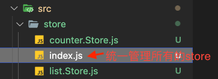

#  React 基础

## React框架的特点

- 声明式
- 组件化
- 跨平台

## 创建React项目

通过 `npc create-react-app 项目名称` 来创建一个React项目

## JSX 基础

### JSX 介绍

JSX 是 `Javascript XML（Html）`的缩写，表示在 JS 代码中书写 html 结构。

JSX 并不是标准的 JS 语法，它是 JS 的语法扩展，浏览器默认是不会识别 JSX 的，脚手架中内置的 `@babel/plugin-trnsform-react-jsx` 包，会来解析 JSX 语法。

### JSX 中使用 JS 表达式

语法：`{ JS表达式 }`

**注意：**只能使用 JS 表达式，不能使用 JS 语句

### JSX 中进行条件渲染

- 使用三元表达式

  ```jsx
  {
    true ? <span>T</span> : null
  }
  ```

- 使用逻辑与 `&&`

  ```jsx
  {
    true && <span>T</span>
  }
  ```

- 使用 JS 函数 if/else

  ```jsx
  // 定义一个用来处理复杂条件判断的函数
  const getHtag = (type) => {
    if (type === 1) {
      return <h1>H1</h1>
    } else if (type === 2) {
      return <h2>H2</h2>
    } else {
      return <h3>H3</h3>
    }
  }
  
  ;<div>getHtag(2)</div>
  ```

### 列表渲染

通过 `js` 中的 `map` 函数来进行列表的渲染。

```jsx
const students = [
  { id: 1, name: 'John' },
  { id: 2, name: 'John2' },
  { id: 3, name: 'John3' },
  { id: 4, name: 'John4' },
]

function StudentInfo() {
  return (
    <ul>
      {students.map((student) => (
        <li key={student.id}>{student.name}</li>
      ))}
    </ul>
  )
}
```


### JSX 中的样式控制

- 行内样式

  在元素上绑定一个 style 属性即可。

  ```jsx
  <span style={{color: 'red', fontSize: '20px'}}>SPAN</span>

  // 或者将样式属性封装到一个对象中
  const span_style = {
    color: 'red',
    fontSize: '20px'
  }
  <span style={ span_style }>SPAN</span>
  ```

- 类名样式

  在元素上通过 className 来进行绑定即可。

  ```jsx
  <span className="span_style">SPAN</span>
  ```

- 动态控制类名

  在满足条件的情况下，才把类名添加上

  ```jsx
  <span className={flag ? 'active' : ''}></span>
  ```

### JSX 中的注意事项

1. JSX 必须有一个根节点，如果没有根节点， 可以使用 ` <> </>` （`幽灵节点`）来替代

   ```jsx
   <>
     <div>div1</div>
     <div>div2</div>
   </>
   ```

2. 所有标签必须形成闭合，成对闭合或者自闭合

3. 属性名采用驼峰命名法，如： `class --> claaName`, `for --> htmlFor`

## React 组件基础

### 函数组件

说明：

- 组件的名称必须`首字母大写`，`react` 内部会根据这个来判断是组件还是普通的 `html` 标签。
- 函数组件必须有返回值，表示该组件的 UI 结构。如果不需要渲染任何内容，则返回 `null`。
- 使用函数名称作为组件标签名称，可以`成对出现`也可以`自闭合`。

```jsx
function Hello() {
  return <div>Hello</div>
}

function App() {
  return (
    <div className="App">
      {/* 自闭合 */} 
      <Hello />
      {/* 成对出现 */} 
      <Hello></Hello>
    </div>
  )
}
```

### 类组件

说明：

- 类名称也必须`首字母大写`
- 类组件应该继承自 `React.Component` 父类或其子类
- 类组件必须提供 `render()` 方法

```jsx
class Hello extends React.Component {
  render() {
    return (
      <div>Hello</div>
    )
  }
}
```

### 事件绑定

语法：

`on + 事件名称 = { 事件处理程序 }` ，如： `<div onClick={ () => {} } ></div>`

React事件采用`驼峰命名法`：如：onClick、onMouseEnter

**注意**：在事件绑定时，绑定的时函数，而不是函数的调用行为～～～

```jsx
// 函数组件的事件绑定
function HelloFn() {
  const clickHandler = (e) => {
    console.log('function click event emit.')
    e.preventDefault()
  }

  return <button onClick={clickHandler}>Click Me!</button>
  {/* 下面这个是错误的写法哦～～～ */}
  {/* return <button onClick={clickHandler(e)}>Click Me!</button> */}
}

// 类组件的事件绑定
class HelloC extends React.Component {
  // 类组件中的事件函数的标准写法（避免this指向问题）
  // 这样写 回调函数中的this指向的是当前组件实例对象
  clickHandler = (e) => {
    console.log('Class Component click event emit.')
  }
  render() {
    return <div onClick={this.clickHandler}>Class Component</div>
  }
}
```

#### 传递自定义参数

```jsx
function HelloFn() {
  const clickHandler = (msg) => {
    console.log('function click event emit.', msg)
  }
  // 这里通过绑定一个箭头函数来绑定clickHendler
  return <button onClick={() => clickHandler('传入参数信息')}>Click Me!</button>
}
```

```jsx
function HelloFn() {
  const clickHandler = (event, msg) => {
    console.log('function click event emit.', e, msg)
  }
  // 传入事件触发对象
  return (
    <button onClick={(e) => clickHandler(e, '传入参数信息')}>Click Me!</button>
  )
}
```

### this 指向问题

在 Javascript 中，`class` 的方法默认不会绑定 `this` 。如果忘记将 class 中的事件函数进行 this 绑定，则当调用这个函数时，`this` 的值为 `undefined`。 

通常情况下，如果没有在方法后面添加`()`， 如：`onClick={this.handleClick}`， 此时应该为 `handleClick` 方法绑定`this`。

类组件的3种绑定方式：

```jsx
// class fields 写法 推荐写法！！
class Test extends React.Component {
  state = {
    count: 0,
  }
  
  setCount = () => {
    this.setState({
      count: this.state.count + 1,
    })
  }

  render() {
    return <button onClick={this.setCount}>{this.state.count}</button>
  }
}
```

```jsx
// 箭头函数的写法 ！
class Test extends React.Component {
  state = {
    count: 0,
  }

  setCount() {
    this.setState({
      count: this.state.count + 1,
    })
  }

  render() {
    // 通过箭头函数进行绑定
    return <button onClick={() => this.setCount()}>{this.state.count}</button>
  }
}
```

```jsx
// 比较老式的写法 ！
class Test extends React.Component {
  constructor(props) {
    super(props)
    this.state = {
      count: 0,
    }
    this.setCount = this.setCount.bind(this)
  }

  setCount() {
    this.setState({
      count: this.state.count + 1,
    })
  }

  render() {
    return <button onClick={this.setCount}>{this.state.count}</button>
  }
}
```

### 表单处理

#### 受控表单组件

`受控组件`就是可以`被react的状态控制的组件`。

```jsx
class Test extends React.Component {
  state = {
    message: 'this is a message',
  }

  changeHandle = (e) => {
    this.setState({
      message: e.target.value,
    })
  }

  render() {
    return (
      <input
        type="text"
        value={this.state.message}
        onChange={this.changeHandle}
      />
    )
  }
}
```


#### 非受控表单组件

非受控组件是通过`手动`操作 `DOM` 的方式获取元素的值，元素的状态不受 `react` 组件的 `state` 中的状态控制。

一般步骤：

1. 导入 `createRef` 函数
2. 调用 `createRef` 函数，创建一个 ref 对象 `msgRef`
3. 为元素添加 ref 属性，值为 msgRef
4. 通过 `msgRef.current` 即可拿到元素对应的DOM元素，再通过 `msgRef.current.value` 拿到元素的值。

```jsx
import React, { createRef } from 'react'

class Test extends React.Component {
  // 使用createRef产生一个存放dom的对象容器
  msgRef = createRef()

  changeHandle = () => {
    console.log(this.msgRef.current.value)
  }

  render() {
    return (
      <div>
        {/* ref绑定，获取真实的dom */}
        <input ref={this.msgRef} />
        <button onClick={this.changeHandle}>click</button>
      </div>
    )
  }
}
```

## React 组件通信

组件之间的通信关系有如下几种：

- 父子关系 -- **最重要的**

- 兄弟关系 -- 自定义事件模式产生技术方法 eventBus / 通过共同的父组件通信
- 其它关系 -- **mobx / redux / 基于hook的方案**

### 父传子

```jsx
function SonF(props) {
  return <div>This is Function Component. {props.msg}</div>
}

class SonC extends React.Component {
  render() {
    return <div>This is Class Component. {this.props.msg}</div>
  }
}

class App extends React.Component {
  state = {
    msg: '我是消息',
  }
  render() {
    return (
      <div>
        <SonF msg={this.state.msg} />
        <SonC msg={this.state.msg} />
      </div>
    )
  }
}
```

### 子传父

子组件通过调用父组件传递过来的函数，并且把想要传递的数据当成函数的实参传入。

```jsx
function Son(props) {
  const { getSonMsg } = props
  return (
    <div>
      This is son.
      <br />
      <button onClick={() => getSonMsg('传给父的消息')}>Click</button>
    </div>
  )
}


function Son2(props) {
  const { getSonMsg } = props
  function clickHandle() {
    const msg = "传给父的消息"
    getSonMsg(msg)
  }
  return (
    <div>
      This is son.
      <br />
      {/* 通过调用自身定义的函数来执行父传递的函数 */}
      <button onClick={clickHandle}>Click</button>
    </div>
  )
}

class App extends React.Component {
  getSonMsg = (msg) => {
    console.log(msg)
  }

  render() {
    return (
      <div>
        <Son getSonMsg={this.getSonMsg} />
      </div>
    )
  }
}
```

### 兄弟组件通信

「核心思路」： 通过`状态提升`机制，利用共同的父组件来实现兄弟组件之间的通信。

```jsx
function SonA(props) {
  return (
    <div>
      This is A.
      {props.sendMsg}
    </div>
  )
}

function SonB(props) {
  const bMsg = '这是来自SonB的消息'
  return (
    <div>
      This is B<br />
      {/* 将数据发送给父组件 */}
      <button onClick={() => props.getSonMsg(bMsg)}>B在发送消息</button>
    </div>
  )
}

class App extends React.Component {
  state = {
    sendAMsg: '',
  }

  getSonBMsg = (msg) => {
    console.log(msg)
    // 将SonB传递过来的数据，通过state发送给SonA组件
    this.setState({
      sendAMsg: msg,
    })
  }

  render() {
    return (
      <div>
        <SonA sendMsg={this.state.sendAMsg} />
        <SonB getSonMsg={this.getSonBMsg} />
      </div>
    )
  }
}
```

### 跨组件通信 Context

`Context` 提供了一个无需为每层组件手动添加props，就能在组件树间进行数据传递。

#### 实现步骤

- 创建 `Context` 对象，导出 `Provider` 和 `Consumer` 对象

```jsx
const {Provider, Consumer} = createContext()
```

- 使用 `Provider` 包裹根组件提供数据

```jsx
<Provider value={this.state.message}>
	{/* 根组件 */}
</Provider>
```

- 需要用到数据的组件使用`Consumer`包裹获取数据

```jsx
<Consumer>
  {value => /* 基于 context 值进行渲染 */}
</Consumer>
```

```jsx
import React, { createContext } from 'react'

const { Provider, Consumer } = createContext()

// App -- A -- C

function ComA() {
  return (
    <div>
      This is ComA.
      <ComC />
    </div>
  )
}

function ComC() {
  return (
    <div>
      This is ComC.
      {/* 通过Consumer包裹要使用数据的地方 */}
      <Consumer>{(value) => <span>{value}</span>}</Consumer>
    </div>
  )
}

class App extends React.Component {
  state = {
    message: 'this is message.',
  }

  render() {
    return (
      // 使用Provider包裹根组件
      <Provider value={this.state.message}>
        <div>
          <ComA />
        </div>
      </Provider>
    )
  }
}
```

## props

- Props 是只读对象
- props可以传递任意数据，如：`数字`、`字符串`、`布尔值`、`数组`、`对象`、`函数`、`JSX` 等。

### children 属性

`children` 属性表示该组件的`子节点`，只要组件内部有子节点，`props` 就会通过 `children` 属性来表示子节点。

`children` 属性可以是：`普通文本`、`普通标签元素`、`函数`、`JSX`。

### props 校验

使用 `prop-types` 包来进行属性校验。 

使用步骤：

1. 安装 `prop-types`： `yarn add prop-types` 。[GitHub地址](https://github.com/facebook/prop-types)
2. 导入 `PropTypes`： `import PropTypes from 'prop-types'`
3. 使用 `组件名.propTypes = {}` 给组件添加校验规则

```jsx
import PropTypes from 'prop-types'

function Test({ list }) {
  return (
    <div>
      {list.map((item) => (
        <p>{item}</p>
      ))}
    </div>
  )
}

Test.propTypes = {
  // 定义各种检验规则
  // 通过导入的PropTypes中的各种类型限定属性来进行限定
  list: PropTypes.array, // 这表示限定 list 为数组类型
}
```

### props 默认值校验

通过 `defaultProps` 可以给组件的`props`设置默认值，在未传入`props`的时候生效。

#### 1、函数组件--默认值

```jsx
// 推荐写法，通过函数参数默认值
function Test({ list, pageSize = 10 }) {
  return (
    <div>
      {list.map((item) => (
        <p key={item}>{item}</p>
      ))}
      <p>PageSize: {pageSize}</p>
    </div>
  )
}
```

```jsx
// 使用defaultProps设置默认值
function Test({ list, pageSize }) {
  return (
    <div>
      {list.map((item) => (
        <p key={item}>{item}</p>
      ))}
      <p>PageSize: {pageSize}</p>
    </div>
  )
}
// 设置默认值
Test.defaultProps = {
  pageSize: 10,
}
```

#### 2、类组件 -- 默认值

```jsx
// 使用defaultProps
class List extends React.Component {
  render() {
    return <div>{this.props.pageSize}</div>
  }
}

List.defaultProps = {
  pageSize: 11,
}
```

```jsx
// 使用类表态属性声明设置默认值
class List extends React.Component {
  static defaultProps = {
    pageSize: 12,
  }
  render() {
    return <div>{this.props.pageSize}</div>
  }
}
```

## 组件的生命周期

注意：`只有类组件才有生命周期`（类组件需要实例化，函数组件不需要实例化）。

组件的生命周期分成 `3` 个 阶段：

1. **挂载阶段**： `constructor` --> `render` --> `componentDidMount`。

| 钩子函数            | 触发时机                                            | 作用                                              |
| ------------------- | :-------------------------------------------------- | ------------------------------------------------- |
| `constructor`       | 创建组件时，最先执行，初始化的时候只执行一次        | 初始化state,创建Ref，使用bind解决this指向问题等。 |
| `render`            | 每次组件渲染都会触发                                | 渲染 UI（`注意：不能在里面调用setState()函数`)    |
| `componentDidMount` | 组件挂载（完成DOM渲染）后执行，初始化的时候执行一次 | 发送网络请求，DOM操作                             |

2. **更新阶段**：`render` --> `componentDidUpdate`。

| 钩子函数             | 触发时机                  | 作用                                                         |
| -------------------- | :------------------------ | ------------------------------------------------------------ |
| `render`             | 每次组件渲染都会触发      | 渲染UI（与挂载阶段是同一个render)                            |
| `componentDidUpdate` | 组件更新后（DOM渲染完毕） | DOM操作，可以获取到更新后的DOM内容，`不要直接调用setState()函数` |

3. **卸载阶段**： `componentWillUnmount` 。

| 钩子函数               | 触发时机                 | 作用                               |
| ---------------------- | :----------------------- | ---------------------------------- |
| `componentWillUnmount` | 组件卸载（从页面中消失） | 执行清理工作（比如：清理定时器等） |


资源地址：https://projects.wojtekmaj.pl/react-lifecycle-methods-diagram/

全生命周图：


# Hooks

## 什么是 Hooks

### 本质 

一套能够使`函数组件`更强大，更灵活的“钩子”。

### 注意

- 有了hooks之后，不能再把函数组件当成无状态的了，因为hooks为函数组件提供了状态
- Hooks 只能在函数组件中使用

### Hooks解决了什么？

Hooks的出现解决了两个问题：

1. 组件的逻辑复用

在 hooks 出现之前，react 先后尝试了mixins混入、HOC高阶组件、render-props 等模式，但都有各自的问题，比如mixin的数据来源不清晰，高阶组件的嵌套问题等等。

2. class 组件自身的问题

class 组件就像一个厚重的“战舰”， 大而全，提供了很多东西，有不可忽视的学习成本，比如各种生命周期，this指向问题等等。

## useState

1. 从 react 中导入 `useState`： 

   ```jsx
   import React, { useState } from 'react'
   ```

2. `useState` 函数会返回两个数据，第1个为状态变量的值，第2个为可以用于修改状态变量的函数。

   ```jsx
   // 可以解析赋值来获取调用useState函数的返回参数值
   // 得到一个初始值为"John"的状态变量 name, 并能通过setName来给 name状态变量赋新的值
   const [name, setName] = useState('John')
   // 进行状态更新, 此时 name 的值会更新为Albert
   setName("Albert")
   ```

3. `useState` 函数可以执行多次，每次执行互相独立，每调用一次为函数组件提供一个状态。

   ```jsx
   function Test() {
     const [name, setName] = useState('abc')
     const [list, setList] = useState([1, 2, 3])
   
     return (
       <div>
         Name: {name}
         <br />
         List: {list}
       </div>
     )
   }
   ```

4. 只能在函数组件中使用 `useState`

5. `不能嵌套`在 `if/for/其它函数`中，（React 按照Hooks的调用顺序识别每一个hook），只能在函数组件的顶层进行执行。

   ```jsx
   if (num / 2 === 0) {
       // 这里是会报错的
       const [count, setCount] = useState(1)
   }
   ```

6. 当初始化的数据无法直接得到，需要通过计算才能获取到，则可以使用`useState(()=>{})` ，则可以将一个函数作为参数传递，函数计算之后的返回值会作为useState函数之后的状态变量的值。

   语法：

   ```jsx
   const [name, setName] = useState(() => { /*计算计算逻辑*/ return '计算之后的值为name的初始值' })
   ```

   ```jsx
   function Counter(props) {
     // useState传入一个函数来进行初始值的计算
     const [count, setCount] = useState(() => {
       return props.count
     })
   
     return <button onClick={() => setCount(count + 1)}>{count}</button>
   }
   
   class App extends React.Component {
     render() {
       return (
         <div>
           <Counter count={10} />
           <Counter count={20} />
         </div>
       )
     }
   }
   ```

## useEffect

`useEffect` 函数的作用就是为react 函数组件提供副作用处理的功能。

常用的副作用：

- 数据请求 ajax发送
- 手动修改dom
- `localstorage` 操作

从 react 中导入 useEffect：`import { useEffect } from 'react'`

通过依赖项来控制 `useEffect` 的执行时机：

1. 默认状态（无依赖项）

   组件初始化的时候先执行一次，然后每次状态数据修改、组件更新再次执行。

   ```jsx
   function Test() {
     const [count, setCount] = useState(0)
     useEffect(() => {
       document.title = count
     })
     return (
       <div>
         <button onClick={() => setCount(count + 1)}>{count}</button>
       </div>
     )
   }
   ```

2. 添加一个`空的数组`依赖项

   只在组件初始化的时候执行一次。

   ```jsx
   function Test() {
     const [count, setCount] = useState(0)
     // 通过 useEffect 函数的第2个参数来传入依赖项
     useEffect(() => {
       document.title = count
     }, [])
     return (
       <div>
         <button onClick={() => setCount(count + 1)}>{count}</button>
       </div>
     )
   }
   ```

3. 依赖特定项

   组件初始化的时候先执行一次，然后只当特定的状态数据依赖项发生变化时，才会再次执行。

   ```jsx
   function Test() {
     const [count, setCount] = useState(0)
     const [name, setName] = useState('John')
     // 通过 useEffect 函数的第2个参数来传入依赖项
     useEffect(() => {
       document.title = count
       // 因为使用了name，虽然只是打印了一下，但也需要在依赖项上添加上name
       console.log(name)
     }, [count, name])
     return (
       <div>
         <button onClick={() => setCount(count + 1)}>{count}</button>
         <button onClick={() => setName('Albert')}>Name: {name}</button>
       </div>
     )
   }
   ```

当组件被销毁时，如果有些副作用操作需要被清理，就可以使用 useEffect ,比如定时器等。

语法：

```jsx
useEffect(() => {
  console.log('副作用执行')

  return () => {
    console.log('清理副作用')
    // 在此处编写清理代码
  }
})
```

## useRef

`useRef` 的作用是用来在函数组件中获取`真实的DOM元素`或者`类组件对象`。

使用步骤：

1. 从`react`中导入`useRef`函数
2. 执行`useRef`函数并传`null` ，返回值为一个`ref`对象，其内部有一个`current`属性存放绑定的dom对象或者类组件对象
3. 通过`ref`绑定要获取的`dom`元素或者类组件

```jsx
class TestC extends React.Component {
  render() {
    return <div>this is TestC</div>
  }
}

function App() {
  // 实例化一个ref对象
  const testCRef = useRef(null)
  const hRef = useRef(null)

  useEffect(() => {
    // ref对象上的current属性表示绑定的DOM元素或者类组件
    console.log(testCRef.current)
    console.log(hRef.current)
  }, [])

  return (
    <div>
      <TestFun />
      {/* 通过 ref属性来进行绑定 */}
      <TestC ref={testCRef} />
      <h1 ref={hRef}>This is a H1</h1>
    </div>
  )
}
```

> 注意：函数组件由于没有实例，不能使用ref来进行绑定，如果想获取组件实例，必须是类组件。

## useContext

useContext 可以在hook中实现跨组件通信机制

使用步骤：

1. 使用 `createContext` 创建`Context`对象
2. 在顶层组件通过`Provider`提供数据
3. 在底层组件通过`useContext`函数获取数据

```jsx
import React, { useState, useContext, createContext } from 'react'

const Context = createContext()

function ComA() {
  // 通过useContext函数来获取数据
  const count = useContext(Context)
  return (
    <div>
      this is ComA.
      <br />
      This is from App Data: {count}
      <ComC />
    </div>
  )
}

function ComC() {
  // 通过useContext函数来获取数据
  const count = useContext(Context)
  return (
    <div>
      this is ComC.
      <br />
      This is from App Data: {count}
    </div>
  )
}

function App() {
  const [count, setCount] = useState(0)

  return (
    // 使用Provider 来提供数据源
    <Context.Provider value={count}>
      <div>
        <ComA />
        <button onClick={() => setCount(count + 1)}>+</button>
      </div>
    </Context.Provider>
  )
}
```

# Router

安装 `react-router-dom@v6`

```shell
yarn add react-router-dom@v6
```

## 核心组件 BrowerRouter

**作用**： 包裹整个应用，一个React应用只需要使用一次。

两种常用的Router：

- `HashRouter`

  使用URL的哈希值实现 (如：http://localhost:3000/#/first)

- `BrowserRouter` (推荐)

  使用 `H5` 的 `history.pushState API` 实现（如：http://localhost:3000/first）

  ```jsx
  import { BrowserRouter, Link, Routes, Route } from 'react-router-dom'
  import Home from './Home'
  import About from './About'
  
  function App() {
    return (
      <BrowserRouter>
        <Link to="/">首页</Link>
        <Link to="/about">关于</Link>
        <Routes>
          <Route path="/" element={<Home />}></Route>
          <Route path="about" element={<About />}></Route>
        </Routes>
      </BrowserRouter>
    )
  }
  ```

## 核心组件 Link

**作用**：用于指定导航链接，完成路由跳转。

`Link` 组件通过`to`属性指定路由地址，最终会渲染为`a`链接元素。

## 核心组件 Routes

**作用**：提供一个路由出口，满足条件的路由组件会渲染到组件内部。

## 核心组件 Route

**作用**：用于指定导航链接，完成路由匹配。

`Route` 通过 `path` 属性指定匹配的路径地址，通过 `element` 属性指定要渲染的组件。

```jsx
<Route path="/index" element={ <Home /> } />
```

## 编程式导航 useNavigate

**作用**：通过编程的方式，根据业务逻辑的需求来确认页面的跳转。

需要使用钩子函数： `useNavigate`

```jsx
// 导入 useNavigate 钩子函数
import { useNavigate } from 'react-router-dom'

function Login() {
  // 执行 useNavigate 得到一个跳转函数
  const navigate = useNavigate()

  function goAbout() {
    // 调用跳转函数传入目标路径
    // 如果提供replace：true, 表示此次跳转不会被写入到浏览器的history中，不能进行回退
    navigate('/about', { replace: true })
  }

  return (
    <div>
      Login
      <button onClick={goAbout}>跳转到关于页面</button>
    </div>
  )
}
```

两种常见的传参方式：

- searchParam 传参

  ```jsx
  import { useNavigate, useSearchParams } from 'react-router-dom'
  // 传参
  navigate('/about?id=100')
  
  // 取参
  let [params] = useSearchParams()
  let id = params.get('id')
  ```

- params 传参

  ```jsx
  import { useNavigate, useParams } from 'react-router-dom'
  
  // 传参
  navigate('/about/100')
  
  // 取参
  let params = useParams()
  let id = params.id
  ```

## 嵌套路由

```jsx
<BrowserRouter>
  <Routes>
    <Route path='/' element={<Layout />}>
      {/* 二级嵌套路由 */}
      {/* 默认二级，添加一个index,并将path属性去掉,这样即可默认加载的路由 */}
      <Route index element={<Board />}></Route>
      <Route path="article" element={<Article/>}></Route>
    </Route>
    <Route path='/login' element={<Login />}></Route>
  </Routes>
</BrowserRouter>

// Layout.js 中的配置
import { Outlet } from 'react-router-dom'

function Layout() {
  return (
    <div>
      This is Layout Page.
      <br />
      {/* 在需要进行二级页面渲染的地方使用Outlet组件即可 */}
      <Outlet />
    </div>
  )
}
```

## 404 路由配置

在各级路由的最后添加 `*号路由` 。

```jsx
function App() {
  return (
    <BrowserRouter>
      <Link to="/">首页</Link>
      <Link to="/about/101">关于</Link>
      <Routes>
        <Route path="/" element={<Home />}></Route>
        <Route path="about/:id" element={<About />}></Route>
        <Route path="/login" element={<Login />}></Route>
        {/* 当所有路由路径都没有匹配时，会渲染此路由下的页面 */}
        <Route path="*" element={<NotFound />}></Route>
      </Routes>
    </BrowserRouter>
  )
}
```

# Mobx

`Mobx` 是一个可以与React良好配置的`状态管理工具`。Mobx是一个独立的响应式库，可以独立于任何UI框架而存在。

`优势`：

1. 简单

   编写无模板的极简代码来精准描述你的意图

2. 轻松实现最优渲染

   依赖自动追踪最小渲染优化

3. 架构自由

   可移植，可测试

`安装`： 

```sh
yarn add mobx mobx-react-lite
# 使用国内源进行安装
yarn add mobx mobx-react-lite --registry=https://registry.npm.taobao.org/
```

**注意**：`mobx-react-lite` 是与`函数组件`配合使用，如果要在`类组件`中使用，则使用 `mobx-react` 包。

## Mobx 使用步骤

```jsx
// 编写一个处理数据的js class 文件
import { makeAutoObservable } from 'mobx'
class CounterStore {
  // 1. 定义数据
  count = 0
  constructor() {
    // 2. 把数据弄成响应式
    makeAutoObservable(this)
  }

  // 3. 定义修改数据函数
  addCount = () => {
    this.count++
  }
}

// 4. 实例化并导出
const counterStore = new CounterStore()
export { counterStore }
```

```jsx
// 使用mobx
import { counterStore } from './store/counter'
// 导入中间件，用于连接mobx react 完成响应式数据的变化
import { observer } from 'mobx-react-lite'
function App() {
  return (
    <div className="App">
      <button onClick={counterStore.addCount}>{counterStore.count}</button>
    </div>
  )
}

// 使用 observer 将组件进行包裹
export default observer(App)
```

## Mobx 中的计算属性 computed

```jsx
import { makeAutoObservable } from 'mobx'
class CounterStore { 
  // 定义一个原始数据 list
  list = [1, 2, 3, 4, 5, 6]
  constructor() {
    // 2. 把数据弄成响应式
    makeAutoObservable(this)
  }

  // 在函数前面添加一个get关键字来定义计算属性
  get filterList() {
    return this.list.filter((item) => item > 2)
  }

  // 修改列表数据
  addList = () => {
    this.list.push(7, 9, 8)
  }
 
// 4. 实例化并导出
const counterStore = new CounterStore()
export { counterStore }

```

```jsx
import { counterStore } from './store/counter'
// 导入中间件，用于连接mobx react 完成响应式数据的变化
import { observer } from 'mobx-react-lite'
function App() {
  return (
    <div className="App"> 
      {/* 使用定义好的计算属性 */}
      {counterStore.filterList.join('-')}
      <br />
      <button onClick={counterStore.addList}>Add</button>
    </div>
  )
}

// 使用 observer 将组件进行包裹
export default observer(App)

```

## mobx 组件化

将所有的需要进行状态管理的数据逻辑都放在一个统一的地方进行管理。

实现步骤：

1. 将store存放在一个统一的位置，并添加一个index.js文件来进管理文件夹下面的stores。

   

   ```jsx
   import React from 'react'
   import { ListStore } from './list.Store'
   import { CounterStore } from './counter.Store'
   
   // 声明一个rootStore
   class RootStore {
     constructor() {
       // 对子模块进行实例化
       this.counterStore = new CounterStore()
       this.listStore = new ListStore()
     }
   }
   // 实例化根store,并注入context
   // 使用 react context机制，完成统一方法封装
   // 核心目的： 让每个业务组件可以通过统一的方法获取store中的数据
   const rootStore = new RootStore()
   const context = React.createContext(rootStore)
   
   // 导出useStore方法, 供组件通过调用该方法来使用
   const useStore = () => React.useContext(context)
   // useContext 优先会从Provider 的value找，如果找不到，则会找createContext方法传递过来的参数
   // 所以，这里通过useContext拿到rootStore实例对象
   export { useStore }
   ```

2. 在需要使用的地方，通过index.js中导出的对象使用即可。

   ```jsx
   import { useStore } from './store/index'
   // 导入中间件，用于连接mobx react 完成响应式数据的变化
   import { observer } from 'mobx-react-lite'
   function App() {
     // 解构赋值，得到需要使用的store对象
     const { counterStore } = useStore()
     return (
       <div className="App">
         {counterStore.count}
         <button onClick={counterStore.addCount}>+</button>
       </div>
     )
   }
   
   // 使用 observer 将组件进行包裹
   export default observer(App)
   ```

# 配置React 工程项目

CRA 将所有工程化配置，都隐藏在 `react-scripts` 包中，项目中看不到任何配置信息。

如果要修改CRA的默认配置信息，有以下两种方案：

- 执行 `yarn eject` 命令，释放 `react-scripts` 中的所有配置信息到项目中，

> 这种方法为不可逆操作，`慎重操作`。

- 通过第三方库进行修改，如使用 `@craco/craco`。

## craco 使用步骤：

1. 安装修改`CRA`配置的包： `yarn add -D @craco/craco`

2. 在项目根目录中创建craco的配置文件：`craco.config.js` ，文件名为固定的。并在配置文件中配置路径别名

   ```js
   const path = require('path')
   
   module.exports = {
     webpack: {
       // 配置别名
       alias: {
         // 约定：使用@表示src文件所在路径
         '@': path.resolve(__dirname, 'src'),
       },
     },
   }
   ```

3. 修改 `package.json` 中的脚本命令，修改为使用 `craco` 方式：

   ```json
   "scripts": {
       "start": "react-scripts start",
       "build": "react-scripts build",
       "test": "react-scripts test",
       "eject": "react-scripts eject"
   },
   // 修改成craco方式：
     "scripts": {
       "start": "craco start",
       "build": "craco build",
       "test": "craco test",
       "eject": "react-scripts eject"
     },
   ```

4. 在代码中，就可以通过 `@` 来表示`src`目录的绝对路径

   如果使用VS Code 编写代码，让vscode 支持 @/ 路径提示，需要在项目的根目录下添加 一个`jsconfig.json` 文件，内容如下：

   ```json
   {
     "compilerOptions": {
       "baseUrl": "./",
       "paths": {
         "@/*": ["src/*"]
       }
     }
   }
   ```

5. 重启项目，让配置生效


## 常用函数和属性

- `this.props.children` 表示组件的所有子节点

  this.props.children 的值有三种可能：

  - 如果当前组件没有子节点，它就是 undefined ;
  - 如果有一个子节点，数据类型是 object ；
  - 如果有多个子节点，数据类型就是 array 。

  所以，处理 this.props.children 的时候要小心。

React 提供一个工具方法 `React.Children` 来处理 this.props.children 。我们可以用 React.Children.map 来遍历子节点，而不用担心 this.props.children 的数据类型是 undefined 还是 object。

```jsx
<script type="text/babel">
    var NotesList = React.createClass({
        render: function () {
        return (
            <ol>
            {
            React.Children.map(this.props.children, function (child) {
                return <li>{child}</li>
            })
            }
            </ol>
        );
        }
    });

    ReactDOM.render(
        <NotesList>
        <span>Hello</span>
        <span>world</span>
        </NotesList>,
        document.getElementById("example")
    );
</script>
```

- `PropTypes` 属性

用来验证组件实例的属性是否符合要求。

- `getDefaultProps()` 用来设置组件属性的默认值

```jsx
var MyTitle = React.createClass({
  getDefaultProps: function () {
    return {
      title: 'Hello World',
    }
  },

  render: function () {
    return <h1> {this.props.title} </h1>
  },
})

ReactDOM.render(<MyTitle />, document.body)
```

- `ref` 属性 用于获取真实的 DOM 节点

```jsx
//第一种方式：这种方式不建议使用了！！！！
<script type="text/babel">
    var MyComponent = React.createClass({
    handleClick: function () {
        this.refs.myTextInput.focus();
    },
    render: function () {
        return (
        <div>
            <input type="text" ref="myTextInput" />
            <input type="button" value="Focus the text input" onClick={this.handleClick} />
        </div>
        );
    }
    });

    ReactDOM.render(
    <MyComponent />,
    document.getElementById("example")
    );
</script>

//第二种方式:
<script type="text/babel">
    class CustomTextInput extends React.Component {
        constructor(props){
            super(props)
            this.focus = this.focus.bind(this)
        }

        focus(){
            this.textInput.focus();
        }

        render(){
            return (
            <div>
                <input type="text" ref={input => this.textInput = input} />
                <input type="button" value="Focus the text input" onClick={this.focus} />
            </div>
            )
        }
    }

    ReactDOM.render(
        <CustomTextInput  />,
        document.getElementById("example")
    );
</script>
```

- `getInitialState()` 用于定义初始状态

- `与运算符 &&`
  在 JavaScript 中，`true && expression` 总是返回 `expression` ，而 `false && expression` 总是返回 `false`

```jsx
function Mailbox(props) {
  const unreadMessages = props.unreadMessages
  return (
    <div>
      <h1>Hello!</h1>
      {unreadMessages.length > 0 && (
        <h2>You have {unreadMessages.length} unread messages.</h2>
      )}
    </div>
  )
}

const messages = ['React', 'Re: React', 'Re:Re: React']
ReactDOM.render(
  <Mailbox unreadMessages={messages} />,
  document.getElementById('root')
)
```

- 扩展属性
  如果你已经有了个 props 对象，并且想在 JSX 中传递它，你可以使用 ... 作为扩展操作符来传递整个属性对象。下面两个组件是等效的：

```jsx
function App1() {
  return <Greeting firstName="Ben" lastName="Hector" />
}

function App2() {
  const props = { firstName: 'Ben', lastName: 'Hector' }
  return <Greeting {...props} />
}
```

**react 中加载带 html 和 css 的内容**：

```html
<CustomDIV dangerouslySetInnerHTML="{{__html:" this.props.content}}></CustomDIV>
```

# React 项目打包

## 项目打包

在项目的根目录下执行：`yarn build` 即可对项目进行打包。

## 项目本地预览

1. 全局安装本地服务包 `yarn global add serve` 。
2. 在项目根目录中执行命令：`serve -s ./build` ，在`build`目录中开启服务器
3. 预览项目

## 项目打包体积分析

1. 安装分析打包体积包：`yarn add source-map-explorer`

2. 在package.json中的scripts标签中，添加分析打包体积的命令

   ```json
   "scripts":{
     "analyze": "source-map-explorer 'build/static/js/*.js'",
   }
   ```

3. 对项目进行打包操作：`yarn build`

4. 运行分析命令：`yarn analyze`

5. 通过浏览器打开的页面，分析图表中的包体积。

## 优化-配置CDN

通过`craco`来修改`webpack`配置，从而实现`CDN`优化。

1. 在项目根目录下的 `craco.config.js` 文件中进行配置：

   ```js
   const { whenProd, getPlugin, pluginByName } = require('@craco/craco')
   const { when } = require('mobx')
   const path = require('path')
   
   module.exports = {
     // webpack配置
     webpack: {
       // 配置别名
       alias: {
         // 约定：使用@表示src文件所在路径
         '@': path.resolve(__dirname, 'src'),
       },
       // 配置CDN
       configure: (webpackConfig) => {
         let cdn = {
           js: [],
           css: [],
         }
   
         // 只有生产环境才配置
         whenProd(() => {
           webpackConfig.externals = {
             react: 'React',
             'react-dom': 'ReactDOM',
           }
           cdn = {
             js: [
               'https://cdn.bootcdn.net/ajax/libs/react/18.2.0/umd/react.production.min.js',
               'https://cdn.bootcdn.net/ajax/libs/react-dom/18.2.0/umd/react-dom.production.min.js',
             ],
             css: [],
           }
         })
         const { isFound, match } = getPlugin(
           webpackConfig,
           pluginByName('HtmlWebpackPlugin')
         )
         if (isFound) {
           // 找到了HtmlWebpackPlugin的插件
           match.userOptions.cdn = cdn
         }
         return webpackConfig
       },
     },
   }
   ```

2. 在 `/public/index.html` 文件中进行如下配置：

   ```html
   <div id="root"></div>
   <!-- 加载和三发包的CDN链接 -->
   <% htmlWebpackPlugin.options.cdn.js.forEach(cdnURL=> { %>
     <script src="<%= cdnURL %>"></script>
     <% }) %>
   ```

3. 重新打包，此时，`react`和`react-dom`包就会从CDN服务器进行拉取了。

# 常用第三方包

## 富文本编辑器 react-quill

安装: `yarn add react-quill`


## UUID 包 react-uuid


---

## react-transition-group

## Redux


## redux-thunk

## immutable.js

https://github.com/immutable-js/immutable-js

## react-router-dom

## **[react-loadable](https://github.com/jamiebuilds/react-loadable)**

用来进行异步加载页面组件，有利于提高首页的访问速度

=======

## Redux-thunk 和 Redux-Saga

## React-redux

## styled-components

用来管理 CSS。用来处理 CSS 污染的问题

https://github.com/styled-components/styled-components

## CSS-Module

同样可以处理 CSS 污染的问题
