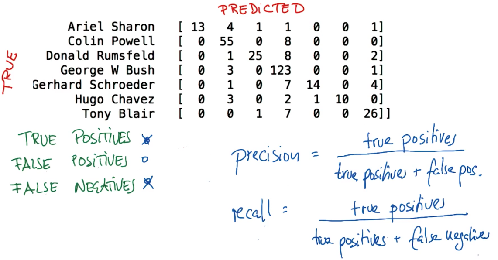
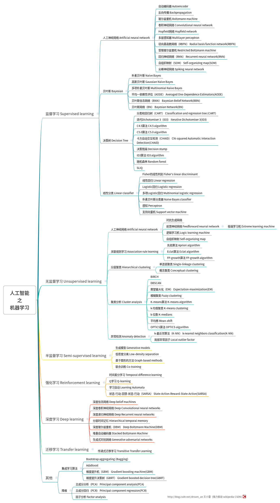

<link rel="stylesheet" href="https://cdnjs.cloudflare.com/ajax/libs/KaTeX/0.5.1/katex.min.css">


#
- 机器学习主要来源于两个领域：`人工智能` 和 `数据科学`
- 机器学习的`核心` ---> `建立数据模型`

- 归纳法、演泽法、溯因法 推理的三种形式。


# 有用的概念

- 众数 Mode

- 均值 Mean

- 中位数 Median

- 四分位差 IQR= Q3 - Q1

    它是上四分位数（Q3，即位于75%）与下四分位数（Q1，即位于25%）的差的平均值。


    四分位差反映了中间50%数据的离散程度，其数值越小，说明中间的数据越集中；其数值越大，说明中间的数据越分散。四分位差不受极值的影响。此外，由于中位数处于数据的中间位置，因此，四分位差的大小在一定程度上也说明了中位数对一组数据的代表程度。四分位差主要用于测度顺序数据的离散程度

- 离均差 ：单项测定值 与 均值 的差

- 绝对偏差: 单项测定值 与 均值 差的绝对值

- 平均偏差 : 离均差之和 除以 总数

- 平均绝对偏差 : 指单项测定值与平均值的偏差（取绝对值）之和，除以测定次数 。即绝对偏差 之和 除以 总个数

- 平方偏差 ： 离均差的平方

- 平均平方偏差（方差variance）: 所有平方偏差和 除以 总个数

- `标准差(SD)` ： 方差 开方得到。 最常用的分布测量方法

    计算步骤： 先计算均值 > 再计算离均差 >  计算平方偏差 >  计算方差 > 计算标准差

    `意义`：     
        第一，大约 `68%` 的数据与 均值的偏差不超过 `1` 个标准差        
        第二，`95%` 的数据与 均值 的偏差不超过 `2` 个标准差

- 贝塞耳校正 （估算标准差或者叫样本标准差） ： 所有平方偏差和 除以 总个数减1 再开方。

- 准确率

- 混淆矩阵 Confusion matrix

- 决策树混淆矩阵

- `查全率（召回率）` recall 

    检出的相关文献量与检出的文献总量的百分比
    ```
    recall = True Positives(真 正实例) / (True Positives(真 正实例) + False Negatives(假 负实例))
    ```
    
- `查准率(精确率)` precision

    检出的相关文献量与检索系统中相关文献总量的百分比
    ```
    precision = True Positives(真 正实例) / (True Positives(真 正实例) + False Positives(假 正实例))
    ```
    

- `F1分数`(F1 Score) *又称平衡F分数（balanced F Score）*

    F1 分数会同时考虑精确率和召回率，以便计算新的分数。

    可将 F1 分数理解为 `精确率` 和 `召回率` 的 *加权平均值*，其中 F1 分数的最佳值为 1、最差值为 0

    ```
    F1 = 2 * precision * recall  / (precision + recall)
    ```

- 异常值

    如果：Outlier < Q1 - 1.5 * (IQR) 或者 Outlier > Q3 + 1.5 * (IQR), 则这个数 Outlier 就被认为是异常值。

## Data Type
+ Numeric Data数值数据
+ Categrical Data分类数据
+ Time-series Data时间序列数据

# Supervised Leaning 监督学习算法
- 监督算法，能用于预测。
- 函数逼近
1. Linear Regression


# Unsupervised Leaning 无监督学习算法
- 可用于学习、练习、预测等等。
- Description,描述


机器学习解决问题三大步骤：
1. 确定目标
    + 业务需求
    + 数据
    + 特征工程（包括数据清洗、数据整合等等）
2. 训练模型
    + 定义模型
    + *定义损失函数*
    + *优化算法*
3. 模型评估
    + 交叉验证
    + 效果评估 


# 算法汇总：

