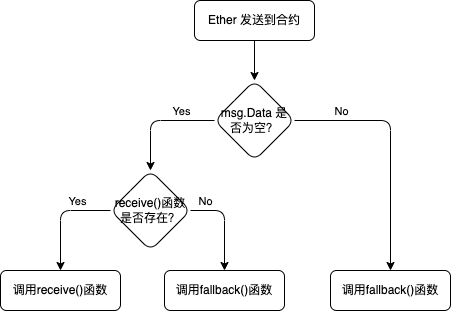

# 智能合约

一个最基本的合约例子：

```solidity {.line-numbers}
// SPDX-License-Identifier: MIT

// 这里表示源代码使用的Solidity版本为0.8.8，并且使用0.8.8以上版本运行也没问题（最高到0.9.0，但不包含0.9.0）
// 关键字 pragma 的含义是，一般来说，pragmas（编译指令）是告知编译器如何处理源代码的指令
pragma solidity ^0.8.8;

contract SimpleStorage {
    uint storedData;

    function set(uint x) public {
        storedData = x;
    }

    function get() public view returns (uint) {
        return storedData;
    }
}
```

**Solidity** 中合约的含义就是一组`代码`（它的函数）和`数据`（它的状态）,它们位于以太坊区块链的一个特定地址上。

在 Solidity 中,所有的标识符（合约名称，函数名称和变量名称）都只能使用 ASCII 字符集。

> 注意：在 Solidity 中，不允许创建一个与变量名称相同的 function。因为 solidity 编译器会生成一个与变量名称相同的函数。

```solidity {.line-numbers}
uint storedData;

// 这个方法是不允许被创建的！！！！！
function storedData() public view returns(uint){
    return storedData;
}
```

# msg 全局变量

> msg.sender 始终是当前（外部）函数调用的来源地址。

# Types

Solidity is a statically language.

## Value Types

### Booleans

### Integers

`uint`默认为`uint256` 它的取值范围为：0 ～ 2**256-1。
`int`默认为`int256` 它的聚会范围为：-2**255 ~ 2\*\*255 -1。

### Address

它是一个 16 进制数字。 `address` 类型是一个 160 位的值，且不允许任何算数操作。

### bytes

## Reference Types

### Struct

```solidity {.line-numbers}
struct Car{
    string model;
    uint year;
    address owner;
}

Car public car;
Car[] public cars;
mapping(address => Car[]) public carsByOwner;

function examples() external {
    Car memory toyota = Car("Toyota", 1990, msg.sender);
    Car memory lambo = Car({year: 1980, model: "Lamborghini", owner: msg.sender});
    Car memory tesla;
    tesla.model = "Tesla";
    tesla.year = 2010;
    tesla.owner = msg.sender;

    cars.push(toyota);
    cars.push(lambo);
    cars.push(tesla);

    cars.push(Car("Ferrari", 2020, msg.sender));

    //使用memory 定义在内在中的变量，修改是无效的，
    Car memory _car = cars[0];
    // 此处的修改不会生效
    _car.year = 1991;

    // 使用storage定义在存储中的变量，即读取了状态变量，则可以进行修改数据了
    Car storage _car2 = cars[0];
    // 此处才能修改
    _car2.year = 1992;

    // delete 不会将元素从数组中或者变量中删除，只会将其用元素的数据类型的默认值进行替换
    delete cars[1];
}
```

### Enum

```solidity {.line-numbers}
enum Status {
    None,
    Pending,
    Shipped,
    Completed,
    Rejected,
    Canceled
}

Status public status;

function get() external view returns (Status) {
    return status;
}

function set(Status _status) external {
    status = _status;
}

function ship() external {
    status = Status.Shipped;
}

// 重置枚举为默认值，即为此枚举的第一个值
function reset() external {
    delete status;
}
```

### Array

动态数组只能用在状态变量中，局部变量只能是定长数组。

```solidity {.line-numbers}
//动态数组
uint[] public nums = [1,2,3];
//定长数组
uint[3] public numsFixed = [4,5,6];

function examples() external {
    //往数组未尾添加元素
    nums.push(4); // [1,2,3,4]

    // delete 不会减少数组的元素个数，只是将指定位置的元素值变为“0”
    delete nums[1]; // [1,0,3,4]
    // 可以用在定长数组上，因为它不会改变数据的长度
    delete numsFixed[1];

    // 从数组的未尾删除一个元素，会改变数组的长度。
    nums.pop(); // [1,0,3]

    // 在内存中定义数组
    // 在内存中定义数组时，只能定义定长的数组
    uint[] memory a_list = new uint[](5);
    delete a_list[2];
    a_list[1] = 10;
}

// 返回数组
function returnArray() external view returns (uint[] memory) {
    return nums;
}
```

### 删除数组指定位置的元素

```solidity {.line-numbers}
uint[] public arrs = [1,2,3,4,5];

// 删除数组指定位置的元素
// 这种方法比较消耗 GAS费
function remove(uint _index) public lessThanArrLingth(_index) {
    //如要删除 arrs 数组的第2个元素,即arrs[1]
    //执行过程： [1,2,3,4,5] -->将要_index后面的元素的值都往前“移”一位 --> [1,3,4,5,5] ---> 执行pop()，将最后的元素pop掉 --> [1,3,4,5]
    for(uint i = _index; i < arrs.length - 1; i++){
        arrs[i] = arrs[i + 1];
    }
    //删除掉数组最后一个元素
    arrs.pop();
}

// 删除数组指定位置的元素
// 这种方法消耗的GAS费，相对上面的方法会少一些
// 但这种方法会打乱数组的排序
function remove2(uint _index) public lessThanArrLingth(_index) {
    //执行过程： [1,2,3,4,5] -->remove2(1)用最后一个元素的值替换要删除位置上的值--> [1,5,4,5,5] ---> 执行pop()，将最后的元素pop掉 --> [1,5,4,5]
    arrs[_index] = arrs[arrs.length -1];
    arrs.pop();
}
```

## Mapping Types

```solidity {.line-numbers}
mapping(address => uint) public balances;
//嵌套Mapping
mapping(address => mapping(address => bool)) public isFriend;

function examples() external {
    //向Mapping中添加Key-Value对
    balances[msg.sender] = 666;
    //获取值
    uint bal = balances[msg.sender];
    //当Key不存在Mapping中时，会返回Value对应的默认值
    uint bal2 = balances[address(1)]; // 0
    // delete 不会将Key-Value从Mapping中删除，只会将Value变为默认值
    delete balances[msg.sender];

    // 嵌套Mapping赋值
    isFriend[msg.sender][address(this)] = true;
}
```

### 迭代映射

```solidity {.line-numbers}
//使用循环遍历数组会消耗比较大的GAS费
mapping(address => uint) public balances;
mapping(address => bool) public inserted;
address[] public keys;

function set(address _key, uint _val) external {
    balances[_key] = _val;
    if(!inserted[_key]){
        inserted[_key] = true;
        keys.push(_key);
    }
}

function getSize() external view returns (uint) {
    return keys.length;
}

function first() external view returns (uint) {
    return balances[keys[0]];
}

function last() external view returns (uint) {
    return balances[keys[keys.length - 1]];
}

function get(uint _i) external view returns (uint) {
    return balances[keys[_i]];
}
```

# Function

Solidity 中有两个关键字， 标识函数的调用不用需要消耗 gas: `view`和`pure`。 只有更改状态的时候才支付 gas。

`view` and `pure` functions disallow modification of state.  
`pure` functions additionally disallow you to read from blockchain state.

If a gas calling function calls a `view` or `pure` function - only then will it cost gas. 如果一个要改变区块链状态的函数调用了`view`或者`pure`函数，才会消耗 gas。

调用`view`函数是免费的，除非在消耗`gas`的函数中调用它。

如果一个函数是`view`函数，意味着我们只会读取这个合约的状态。`view函数`不允许修改任何状态。 `pure`函数还不允许读取区块链数据。

```solidity {.line-numbers}
uint256 public favoriteNumber;

function retrieve() public view returns(uint256){
    return favoriteNumber;
}

function add() public pure returns(uint256) {
    return (1+1);
}
```

## Function Visibility Specifiers

- `public`: 在外部和内部都可见(visible externally and internally)
- `private`: 表示只对合约内部可见(only visible in the current contract)
- `internal`: 表示只有这个合约或者继承它的合约可见(only visible internally)
- `external`: 表示只对合约外部可见(only for functions)，继承合约也看不到，如果在一个合约内部需要访问其 external 声明的函数，可以通过`this.`来进行访问, 但这种方式会浪费 GAS 费：

  ```solidity {.line-numbers}
  function externalFunc() external pure {
      // code...
  }
  function examples() external view{
      this.externalFunc();
  }
  ```

变量和函数如果没有指定可见度标识符，默认为`internal`。

## Function Modifier

函数修改器，可以用来将一些公共的函数功能提取到这里。

```solidity {.line-numbers}
contract FunctionModifier {
    bool public paused;
    uint public count;

    function setPaused(bool _paused) external {
        paused = _paused;
    }

    // 使用关键字modifier来定义一个函数修改器
    modifier whenNotPaused(){
        //这里表示，如果paused==false,则不再执行
        require(!paused, "paused");
        //必须有_;，它表示继续执行其函数体的代码
        _;
    }

    //添加 “whenNotPaused”，表示使用定义好的定义修改器
    function inc() external whenNotPaused {
        count += 1;
    }

    function dec() external whenNotPaused {
        count -= 1;
    }

    //带参数的函数修改器
    modifier cap(uint _x){
        require(_x < 100, "x >= 100");
        _;
    }

    // 使用了2个函数修改器
    function incBy(uint _x) external whenNotPaused cap(_x) {
        count += _x;
    }
}
```

## Constructor 构造函数

`constructor`构造函数只在合约部署时会调用一次。

```solidity {.line-numbers}
contract ConstructorTest {
    // 表示部署者的地址
    address public owner;
    uint public x;

    constructor(uint _x) {
        owner = msg.sender;
        x = _x;
    }
}
```

## Fallback 回退函数

一个合约不存在回退函数，此时让这个合约发送主币时，会报错。

回退函数有两个功能：

- 当在合约中调动不存在的函数时，会调用**回退函数**
- 当向合约中发送主币时，会调用**回退函数**

回退函数有 2 种写法：

```solidity {.line-numbers}
contract Fallback {

    event Log(string func, address sender, uint value, bytes data);

    fallback() external payable {
        emit Log("fallback", msg.sender, msg.value, msg.data);
    }

    receive() external payable {
        emit Log("receive", msg.sender, msg.value, "");
    }
}
```

2 种回退函数的调用关系：


## 不可变变量 immutable

使用`immutable`声明的变量为不可变变量，不可变变量它能节约`GAS费`。它的赋值有 2 种方式：第一种：在声明时进行赋值，第二种：在构造函数中进行赋值。

```solidity {.line-numbers}
contract ImmutableExample {
    // 第一种：在声明时进行赋值
    address public immutable owner = msg.sender;

    address public immutable owner2;

    第二种：在构造函数中进行赋值
    constructor() {
        owner2 = msg.sender;
    }
}
```

## payable 关键字

一个函数如果标注了`payable`关键字，则此函数可以接受以太坊主币的传入。

一个`address`地址变量标注了`payable`关键字，则此地址变量可以发送主币了。

```solidity {.line-numbers}
contract PayableExample {
    address payable public owner;

    constructor() {
        // 由于msg.sender这个地址，是不具有发送主币的功能
        // 所以使用payable进行包装，让它具有发送主币的功能
        owner = payable(msg.sender);
    }

    // 向合约发送主币
    function deposit() external payable{}

    // 获取当前合约的余额
    function getBalance() external view returns (uint) {
        return address(this).balance;
    }
}
```

# Event 事件

`Event`事件是一种记录当前智能合约运行状态的方法，但它并不记录在状态变量中,而是会体现在区块链浏览器上或者是体现在交易记录中的 logs 里。

事件比使用状态变量来存储信息更节约 GAS 费。

```solidity {.line-numbers}
// 申明事件
event Log(string message, uint val);
// 使用 indexded 进行标识过的参数，在链外是可以进行搜索查询。
// 注意：在一个事件中，带索引indexed的参数最多为3个，超过3个就会报错。
event IndexedLog(address indexed sender, uint val);

event Message(address indexed _from, address indexed _to, string message);

// 带有触发的方法，不能指定为view 或者 pure，因为事件也是需要在链上进行记录的
function examples() external {
    //使用 emit 来触发事件
    // 事件会被汇报到交易记录的logs里，同时也会体现在区块链浏览器上
    emit Log("foo", 123);

    emit IndexedLog(msg.sender, 1111);
}

function sendMessage(address _to, string calldata message) external {
    emit Message(msg.sender, _to, message);
}
```

# Inherit 继承

- 单继承：

```solidity {.line-numbers}
contract A {
    // 添加 virtual 表示 子合约可以重写此函数
    function foo() public pure virtual returns (string memory) {
        return "foo-A";
    }

    function bar() public pure virtual returns (string memory) {
        return "bar-A";
    }

    function baz() public pure returns (string memory) {
        return "baz-A";
    }
}

contract B is A {
    // 需要添加 override 表示重写父合约的函数，不加此项，会报错
    function foo() public pure override returns (string memory) {
        return "foo-B";
    }

    // 如果还需要让其他合约重写，就需要不回virtual，不管这个函数是不是重写自父合约
    function bar() public pure virtual override returns (string memory) {
        return "bar-B";
    }
}

contract C is B {
    function bar() public pure override returns (string memory) {
        return "bar-C";
    }
}
```

- 多继承：

要进行多继承时，一定要将最父级写在前面，然后再写次低级，依以类推下去。

```solidity {.line-numbers}
contract A {
    // 添加 virtual 表示 子合约可以重写此函数
    function foo() public pure virtual returns (string memory) {
        return "foo-A";
    }

    function bar() public pure virtual returns (string memory) {
        return "bar-A";
    }

    function baz() public pure returns (string memory) {
        return "baz-A";
    }
}

contract B is A {
    // 需要添加 override 表示重写父合约的函数，不加此项，会报错
    function foo() public pure virtual override returns (string memory) {
        return "foo-B";
    }

    // 如果还需要让其他合约重写，就需要不回virtual，不管这个函数是不是重写自父合约
    function bar() public pure virtual override returns (string memory) {
        return "bar-B";
    }
}

contract D is A, B {
    // override(A,B)  表示要重写哪些父合约的相同函数，
    // 如果所有父合约都有，并都写了virtual声明，则都需要加上
    function foo() public pure override(A,B) returns (string memory) {
        return "foo-D";
    }
    function bar() public pure override(A,B) returns (string memory) {
        return "bar-D";
    }
}
```

- 继承构造函数带参数的父合约

```solidity {.line-numbers}
contract A {
    string public name;

    constructor(string memory _name) {
        name = _name;
    }
}

contract B {
    string public text;

    constructor(string memory _text) {
        text = _text;
    }
}

// 父级合约中的构造函数执行顺序，是按继承顺序来进行执行

// 第1种 给父级合约中带参数的构造函数传参
contract C is A("A"), B("B"){
    //code
}

// 第2种 给父级合约中带参数的构造函数传参
contract D is A, B {
    constructor(string memory _name, string memory _text) A(_name) B(_text) {
        // code
    }
}

// 第2种 给父级合约中带参数的构造函数传参
contract E is A("A"), B {
    constructor(string memory _text) B(_text) {
        //code
    }
}
```

如果要调用父合约中被重写的函数，可以通过**父合约的名称**或者`super`来调用。

# Errors & Warnings

`Warnings` won't stop your code from working but it's usually a good idea to check them out.

**3 种报错**控制：`require`、`revert`、`assert`，这 3 种方式都会让`GAS费退回`和各种`状态回滚`。还有`自定义错误`，它可以节约 GAS 费。

```solidity {.line-numbers}
function testRequire(uint _i) public pure{
    // 表示当_i > 10 时，就报错，报错信息为："i > 10"
    require(_i <= 10, "i > 10");
}
```

`revert` 不能包含表达式。

```solidity {.line-numbers}
function testRevert(uint _i) public pure {
    if (_i > 10){
        revert("i > 10");
    }
}
```

`assert` 断言，不能提供报错信息

```solidity {.line-numbers}
function testAssert(uint _i) public pure {
    assert(_i <=10);
    //code
}
```

自定义报错：

```solidity {.line-numbers}
//使用关键字error进行自定义报错的定义
//使用自定义报错，可以节约GAS费
error MyError(address caller, uint i);

function testCustomErro(uint _i) public view {
    if (_i > 10){
        revert MyError(msg.sender, _i);
    }
}
```

# 数据的存储位置 Data Locations

在智能合约中，数据可以存储在：`Memory`、`Storage`、`Calldata`中。

- 存储在`storage`中的是状态变量
- `memory`中的是局部变量，即在其函数或者其他的作用域内有效，而并不会被写入到链上，离开作用域即失效。
- `calldata`与`memory`类似，但它只能用在函数的输入参数中。在参数中使用`calldata`可以节约`GAS`费。

```solidity {.line-numbers}
struct MyStruct {
    uint foo;
    string text;
}

mapping(address => MyStruct) public myStructs;

// calldata 只能用在输入参数中，并且使用calldata可以节约GAS费
// 在参数中有数组、字符串、结构体时，必须给参数加上calldata或者memory
function examples(uint[] calldata y, string calldata s, MyStruct calldata _mystruct) external returns (uint[] memory) {
    myStructs[msg.sender] = MyStruct({foo: 123, text: "bar"});
    MyStruct storage myStruct = myStructs[msg.sender];
    // 会修改链上的数据状态
    myStruct.text = "foo";

    MyStruct memory readOnlyStruct = myStructs[msg.sender];
    // 并不会修改链上的状态
    readOnlyStruct.foo = 353;

    uint[] memory memArr = new uint[](3);
    memArr[0] = 332;

    return memArr;
}
```

```solidity {.line-numbers}
struct Todo{
    string text;
    bool completed;
}

Todo[] public todos;

function create(string calldata _text) external {
    todos.push(Todo({
        text: _text,
        completed: false
    }));
}

function updateText(uint _index, string calldata _text) external {
    // 当只有一个数据需要进行更新时，使用这种方法会比较节约GAS费
    todos[_index].text = _text;

    // // 如果有多个数据需要进行更新，则使用这种方法比较节约GAS费
    // // 首先将需要更新的对象读取到storage 对象中，再进行更新操作
    // Todo storage todo = todos[_index];
    // todo.text = _text;
    // todo.text = _text;
    // todo.text = _text;
}

function get(uint _index) external view returns (string memory, bool){
    // 这里使用storage比memory更节约GAS费，因为storage时是直接从状态变量中读取出来的，通过一次拷贝即可返回
    // 使用memory时，则会进行两次拷贝，所以更耗GAS费
    // Todo memory todo = todos[_index];
    Todo storage todo = todos[_index];
    return (todo.text, todo.completed);

    //比上面的方式进行返回，这种会消耗更多的GAS
    // return (todos[_index].text, todos[_index].completed);
}

function toggleCompleted(uint _index) external {
    todos[_index].completed = !todos[_index].completed;
}
```

# 合约操作

## 1、合约中发送主币的方法

- `transfer`: 只会带有 2300 个 GAS，如果失败就会 revert
- `send`: 只会带有 2300 个 GAS，会返回一个 bool 来标识是否成功
- `call`: 会发送所有剩余的 GAS，会返回一个 boolgo 标识是否成功，还有一个 data。

```solidity {.line-numbers}
// 用于发送主币的合约
contract SendEther {
    //通过构造函数，让在部署合约时，使合约中有一定的主币数量
    constructor() payable {}

    receive() external payable{}

    // 通过 transfer()函数发送主币
    function sendViaTransfer(address payable _to) external payable {
        // 123 表示 123Wei
        _to.transfer(123);
    }

    // 通过 send()函数发送主币
    function sendViaSend(address payable _to) external payable {
        bool sent =  _to.send(123);
        require(sent, "send failed");
    }

    // 通过 call()函数发送主币
    function sendViaCall(address payable _to) external payable {
        (bool success,) = _to.call{value: 123}("");
        require(success, "fall failed");
    }

    // 返回合约剩余的主币数额， 单位为Wei
    function getBalance() external view returns (uint) {
        return address(this).balance;
    }
}

// 用于接收主币的合约
contract EthReceiver {
    // 通过事件记录，接收到的主币信息
    /**
    * amount: 接收到的主币数量(单位为Wei)
    * gas: 剩余的 gas
    */
    event Log(uint amount, uint gas);

    // 当接收到主币时，会调用receive()
    receive() external payable {
        emit Log(msg.value, gasleft());
    }

    // 返回合约剩余的主币数额， 单位为Wei
    function getBalance() external view returns (uint) {
        return address(this).balance;
    }
}
```

## 2、从合约中提款

```solidity {.line-numbers}

contract EtherWallet {
    // 合约拥有者
    address payable public immutable owner;

    // 通过事件记录，接收到的主币信息
    /**
    * amount: 接收到的主币数量(单位为Wei)
    * gas: 剩余的 gas
    */
    event Log(uint amount, uint gas);

    constructor() payable {
        // 通过构造函数来设置合约的拥有者
        owner = payable(msg.sender);
    }

    // 当合约接收到主币时，会调用
    receive() external payable {
        emit Log(msg.value, gasleft());
    }

    // 从合约中提款
    function withdraw(uint _amount) external {
        // 只有合约的拥有者才能进行提款
        require(msg.sender == owner, "caller is not owner");

        payable(msg.sender).transfer(_amount);

        // // call()函数不需要发送者具有payable属性也可以进行发送主币
        // (bool success, ) = msg.sender.call{value: _amount}("");
        // require(success, "Failed to send Ether");
    }

    // 获取合约中的主币余额,单位为Wei
    function getBalance() public view returns (uint) {
        return address(this).balance;
    }
}
```

## 调用其他合约

```solidity {.line-numbers}
contract CallTestContract {

    // 通过合约的地址来，实例化目标合约对象
    function setX(address  _test, uint _x) external {
        TestContract(_test).setX(_x);
    }

    // 直接将目标合约对象以参数形式进行传递
    function setX2(TestContract _test, uint _x) external {
        _test.setX(_x);
    }

    function getX(address  _test) external view returns (uint) {
        return TestContract(_test).getX();
    }

    function getXandValue(address  _test) external view returns (uint, uint) {
        return TestContract(_test).getXandValue();
    }

    // 向目标合约操作带发送主币功能
    function setXandSendEther(address  _test, uint _x) external payable  {
        TestContract(_test).setXandReceiveEther{value: msg.value}(_x);
    }
}

contract TestContract {
    uint public x;
    uint public value = 123;

    function setX(uint _x) external {
        x = _x;
    }

    function getX() external view returns (uint) {
        return x;
    }

    function setXandReceiveEther(uint _x) external payable {
        x = _x;

        value = msg.value;
    }

    function getXandValue() external view returns (uint, uint) {
        return (x, value);
    }
}
```

## 通过 Interface 接口调用其他合约

有时，我们并不知道一个合约的原代码，或者它的代码非常大，此时，我们可以通过`Interface`来调用。

```solidity {.line-numbers}
// 目标调用合约
contract Counter {
    uint public count;

    function inc() external {
        count += 1;
    }

    function dec() external {
        count -= 1;
    }
}

// 接口
interface ICounter {
    function count() external view returns (uint);
    function inc() external;
}

contract CallInterface {
    uint public count;

    // 参数为被调用的合约的地址
    function examples(address _counter) external {
        ICounter(_counter).inc();
        count = ICounter(_counter).count();
    }
}
```

## 通过 call() 调用其他合约

```solidity {.line-numbers}
contract TestCall {
    string public message;
    uint public x;

    event Log(string message);

    // 如果调用了这个合约中不存在的函数，就会触发fallback()回退函数
    // 如果调用这个合约中的函数时，存在发送主币，此时也会调用fallback()函数
    fallback() external payable {
        emit Log("fallback was called");
    }

    function foo(string memory _message, uint _x) external payable returns (bool, uint) {
        message = _message;
        x = _x;
        return (true, 999);
    }
}

contract Call {

    bytes public data;

    /*
     * 调用一个地址的call()时，通过abi.encodeWithSignature来调用该合约中的函数
    */
    function callFoo(address _test) external payable {
        (bool success, bytes memory _data) = _test.call{value: 111}(abi.encodeWith Signature("foo(string, uint256)", "call foo", 123));
        require(success, "call failed");

        data = _data;
    }

    //调用合约中不存在的函数
    function callDoseNotExitFuc(address _test) external payable {
        (bool success,) = _test.call(abi.encodeWithSignature("doesNotExitFuc()"));
        require(success, "call failed");
    }
}
```

## Delegate 委托调用

```solidity {.line-numbers}
// 被调用的合约
contract TestDelegateCall {
    uint public num;
    address public sender;
    uint public value;

    function setVars(uint _num) external payable {
        num = _num;
        sender = msg.sender;
        value = msg.value;
    }
}

// 委托合约
/*
 * 注意几点：
 * 第1: 通过委托合约调用时， 它并不会改变被调用合约中的状态变量的值，即，它只会利用被调用的合约的函数功能来改变本身合约中的状态。
 * 第2: 委托合约中的变量的顺序和类型必须与被调用合约中的保持一致！
*/
contract DelegateCall {
    uint public num;
    address public sender;
    uint public value;

    function setVars(address _test, uint _num) external payable {
        // _test.delegatecall(abi.encodeWithSignature("setVars(uint256)", _num));
        // 通过委托调用TestDelegateCall合约中的函数
        (bool success, bytes memory data) = _test.delegatecall(
            abi.encodeWithSelector(TestDelegateCall.setVars.selector, _num)
        );

        require(success, "delegatecall failed");
    }
}
```

## Create2 部署合约

```solidity {.line-numbers}
ontract DeployWithCreate2 {
    address public owner;

    constructor(address _owner){
        owner = _owner;
    }
}

// 使用Create2部署合约，可以在合约部署之前就知道合约的地址
contract Create2Factory {
    event Deploy(address addr);

    // 部署合约 , _salt--盐
    function deploy(uint _salt) external {
        DeployWithCreate2 _contract = new DeployWithCreate2{
            salt: bytes32(_salt)
        }(msg.sender);

        emit Deploy(address(_contract));
    }

    // 计算出地址
    function getAddress(bytes memory bytecode, uint _salt) public view returns (address) {
        bytes32 hash = keccak256(
            abi.encodePacked(
                // 固定值，当前合约的地址， 盐， 机器码
                bytes1(0xff), address(this), _salt, keccak256(bytecode)
            )
        );

        return address(uint160(uint(hash)));
    }

    // 获取机器码
    function getBytecode(address _owner) public pure returns (bytes memory) {
        bytes memory bytecode = type(DeployWithCreate2).creationCode;

        return abi.encodePacked(bytecode, abi.encode(_owner));
    }
}
```

## Multi Call 多重调用

`Multi Call`可以同时向一个或者多个合约一次发送调用的功能。这样可以解决一些比如时间同步同时的问题。

```solidity {.line-numbers}
contract TestMultiCall {
    function func1() external view returns (uint, uint) {
        return (1, block.timestamp);
    }

    function func2() external view returns (uint, uint) {
        return (2, block.timestamp);
    }

    //  获取函数1的Data
    function getData1() external pure returns (bytes memory) {
        // abi.encodeWithSignature("func1()");
        return abi.encodeWithSelector(this.func1.selector);
    }

    //  获取函数2的Data
    function getData2() external pure returns (bytes memory) {
        // abi.encodeWithSignature("func2()");
        return abi.encodeWithSelector(this.func2.selector);
    }
}

// 将多个函数调用，打包成一次调用执行
contract MultiCall {
    // targets 表示需要调用哪些合约的地址
    // data 表示与调用的函数Data，必须与targets一一对应
    function multiCall(address[] calldata targets, bytes[] calldata data) external view returns (bytes[] memory) {
        require(targets.length == data.length, "target length != data length");

        // 表示每个调用的返回数据集合
        bytes[] memory results = new bytes[](data.length);

        for(uint i; i < targets.length; i++) {
            // 使用address上的staticcall函数来执行调用操作
            (bool success, bytes memory result) = targets[i].staticcall(data[i]);
            require(success, "call failed");
            results[i] = result;
        }

        return results;
    }
}
```

## Multi Delegate Call 多重委托调用

```solidity {.line-numbers}
// 使用委托调用，只能委托调用自己
contract MultiDelegatecall {

    error DelegatecallFailed();

    function multiDelegatecall(bytes[] calldata data) external payable returns (bytes[] memory results){
        results = new bytes[](data.length);

        for(uint i; i < data.length; i++){
            // 委托调用，只能调用自己，所以地址只能使用调用者自己的，并通过address 的 delegatecall函数进行委托调用
            (bool ok, bytes memory res) = address(this).delegatecall(data[i]);
            if (!ok) {
                revert DelegatecallFailed();
            }

            results[i] = res;
        }

        return results;
    }
}

contract TestMultiDelegateCall is MultiDelegatecall {
    event Log(address caller, string func, uint i);

    function func1(uint x, uint y) external {
        emit Log(msg.sender, "func1", x + y);
    }

    function func2() external returns (uint) {
        emit Log(msg.sender, "func2", 2);
        return 12;
    }
}

// 用来获取调用的函数的Data数据
contract Helper {
    function getFunction1Data(uint x, uint y) external pure returns (bytes memory) {
        return abi.encodeWithSelector(TestMultiDelegateCall.func1.selector, x, y);
    }

    function getFunction2Data() external pure returns (bytes memory) {
        return abi.encodeWithSelector(TestMultiDelegateCall.func2.selector);
    }
}
```

## Abi 解码

```solidity {.line-numbers}
contract AbiDecode {

    struct MyStruct {
        string name;
        uint[2] nums;
    }

    // abi编码
    function encode(uint x, address addr, uint[] calldata arr, MyStruct calldata myStruct) external pure returns (bytes memory) {
        // 编码时的顺序，在解码时也需要保持一致
        return abi.encode(x, addr, arr, myStruct);
    }

    // abi解码
    function decode(bytes calldata data) external pure returns (uint x, address addr, uint[] memory arr, MyStruct memory myStruct){
        // 解码时，需要知道进行编码时的各变量的类型顺序
        (x, addr, arr, myStruct) = abi.decode(data, (uint, address, uint[], MyStruct));
    }
}
```

# Hash 算法

在 solidity 合约中，使用`keccak256()`函数来进行 Hash 运算，在运算之前，需要通过`abi.encode`或者`abi.encodePacked`将参数进行打包，然后再传给`keccak256`进行 Hash 运算。

```solidity {.line-numbers}
function hash(string memory text, uint num, address addr) external pure returns (bytes32) {
        // 在进行Hash算法运算时，使用abi.encode()函数对参数进行打包时，会生成一个定长的bytes,并且各参数之间会通过补0的方式来达到定长
        // 使用abi.encodePacked()函数打包时，只会将各参数生成一个不定长的bytes，只时就有可能存在hash碰撞的可能，所以使用它打包时，
        // 需要注意这一点，可以将各个参数使用一个数字或者字符串进行隔离，这样就可以避免Hash碰撞
        return keccak256(abi.encode(text, num, addr));
        // return keccak256(abi.encodePacked(text, num, addr));
    }
```

# 签名验证

```solidity {.line-numbers}
/*
 * 验证消息签名的步骤：
 * 1、 将消息进行签名
 * 2、 将消息进行Hash， hash(message)
 * 3、 将消息和私钥进行签名（在链下完成） sign(hash(message), private key)
 * 4、 恢复签名，通过专门的ecrecover()进行, 它会计算出来一个地址，如果这个地址等于签名人的地址就表示签名是正确的
 *      ecrecover(hash(message), signature) == signer
*/

contract VerifySig {
    /*
     * 验证签名
     * _signer --- 签名人的地址
     * _message --- 被签名的数据
     * _sig --- 签名的结果
    */
    function verify(address _signer, string memory _message, bytes memory _sig) external pure returns (bool){
        // 对消息进行Hash
        bytes32 messageHash = getMessageHash(_message);
        //
        bytes32 ethSignedMessageHash = getEthSignedMessagedHash(messageHash);

        return recover(ethSignedMessageHash, _sig) == _signer;
    }

    // 对消息进行Hash
    function getMessageHash(string memory _message) public pure returns(bytes32) {
        return keccak256(abi.encodePacked(_message));
    }

    // 对消息Hash的结果，再进行一次Eth 签名Hash运算
    function getEthSignedMessagedHash(bytes32 _messageHash) public pure returns (bytes32){
        return keccak256(abi.encodePacked(
            "\x19Ethereum Signed Message:\n32",
            _messageHash
        ));
    }

    // 恢复签名人的地址
    function recover(bytes32 _ethSignedMessageHash, bytes memory _sig) public pure returns(address) {
        // r,s,v在非对称加密中
        (bytes32 r, bytes32 s, uint8 v) = _split(_sig);
        return ecrecover(_ethSignedMessageHash, v, r, s);
    }

    // 将签名分割为 r,s,v三个变量
    function _split(bytes memory _sig) internal pure returns (bytes32 r, bytes32 s, uint8 v){
        // 签名的长度为65
        require(_sig.length == 65, "invalid signature length");

        // 使用内联汇编来获取三个变量值
        assembly{
            r := mload(add(_sig, 32))
            s := mload(add(_sig, 64))
            v := byte(0, mload(add(_sig, 96)))
        }
    }
}
```

# selfdestruct 自毁合约

合约自毁，通过内置`selfdestruct()`函数执行。

自毁合约会执行以下 2 个步骤：

1. 删除合约
2. 将合约中剩余的主币强制地发送到一个指定的地址上

```solidity {.line-numbers}
// 要被自毁的合约
contract TestContract {
    // 使用构造函数，可以在创建合约时，给合约一些主币
    construct() payable {}

    // 用于自毁的函数
    function kill() external {
        // 在进行自毁时，可以对发送自毁的地址进行一些判断，比如，必须是合约创建者才能发起合约的自毁
        // 传入用于强制接收自毁时，发送合约中剩余主币的地址
        selfdestruct(payable(msg.sender));
    }

    function testIfKilled() external pure returns (uint) {
        return 123;
    }
}

contract HelpContract {
    // 获取当前合约主币的余额
    function getBalance() external view returns (uint) {
        return address(this).balance;
    }

    // 发送使TestContract合约自毁的函数
    function kill(TestContract _testContract) external {
        _testContract.kill();
    }
}

```

# ERC20 合约

```solidity {.line-numbers}
// ERC20 接口
interface IERC20 {
    // 表示当前合约的Token总量
    function totalSupply() external view returns (uint);

    // 返回某个账户的当前余额
    function balanceOf(address account) external view returns (uint);

    // 从当前发送者账户发送 amount 数量的主币到 recipient 账户
    function transfer(address recipient, uint amount) external returns (bool);

    // 检查从owner账户发送到spender账户的主币数量的批准额度
    function allowance(address owner, address spender) external view returns (uint);

    // 批准 将当前发送者账户中 amount 数量的主币 发送到spender账户
    function approve(address spender, uint amount) external returns (bool);

    // 转账
    function transferFrom(address sender, address recipient, uint amount) external returns (bool);

    // 转账事件
    event Transfer(address indexed from, address indexed to, uint amount);
    // 批准额度事件
    event Approve(address indexed owner, address indexed spender, uint amount);
}

contract ERC20 is IERC20 {
    // totalSupply 属性为public ,它就默认实现了接口中的totalSupply()函数
    uint public totalSupply;
    // 合约中的账本，地址与token数的对应，它默认就实现了接口中的balanceOf()函数
    mapping(address => uint) public balanceOf;
    // 批准的对应， 它默认就实现了接口中的allowance()函数
    mapping(address => mapping(address => uint)) public allowance;
    // token的名称
    string public name = "Test";
    // token的缩写或者token的符号
    string public symbol = "TEST";
    // token的精度
    uint8 public decimals = 18;

    //发送指定数量的主币到recipient地址
    function transfer(address recipient, uint amount) external returns (bool){
        // 从发送者中减掉amount的主币
        balanceOf[msg.sender] -= amount;
        // 给接收者加上amount的主币
        balanceOf[recipient] += amount;
        // 触发转账事件
        emit Transfer(msg.sender, recipient, amount);

        return true;
    }


    // 批准授权额度
    function approve(address spender, uint amount) external returns (bool){
        // 批准的额度，如果设置为0，则表示取消批准的额度
        allowance[msg.sender][spender] = amount;
        emit Approve(msg.sender, spender, amount);
        return true;
    }

    //
    function transferFrom(address sender, address recipient, uint amount) external returns (bool){
        allowance[sender][msg.sender] -= amount;
        balanceOf[sender] -= amount;
        balanceOf[recipient] += amount;

        emit Transfer(sender, recipient, amount);

        return true;
    }

    // 给指定账户注入amount数量的主币
    // 需要进行权限控制
    function mint(uint amount) external {
        balanceOf[msg.sender] += amount;
        totalSupply += amount;

        emit Transfer(address(0), msg.sender, amount);
    }

    // 注消 amount 数量的主币
    function burn(uint amount) external {
        balanceOf[msg.sender] -= amount;
        totalSupply -= amount;

        emit Transfer(msg.sender, address(0), amount);
    }
}
```

# 多签名合约

```solidity {.line-numbers}
contract MultiSigWallet {
    // 存储事件
    event Deposit(address indexed sender, uint amount);
    // 交易申请事件
    event Submit(uint indexed txId);
    // 签名人进行批准事件
    event Approve(address indexed owner, uint indexed txId);
    // 撤消批准事件
    event Revoke(address indexed owner, uint indexed txId);
    // 执行
    event Execute(uint indexed txId);

    struct Transaction {
        // 接收方的地址
        address to;
        // 发送的主币数量
        uint value;
        // 表示如果接收方的地址为一个合约地址，此时还可以执行合约中的一些函数
        bytes data;
        // 表示此转账是否已经成功执行
        bool executed;
    }

    // 合约的签名人
    address[] public owners;
    // 地址是不是合约的签名人的映射，在合约中尽量不用使用for循环，它太消耗GAS费
    mapping(address => bool) public isOwner;
    // 表示需要至少多少个签名人确认才能进行转账
    uint public required;
    // 记录合约中所有的阎肃
    Transaction[] public transactions;
    // 表示某个交易ID号下，签名人地址是否批准了这个交易
    // 交易的ID -> 签名人的地址 -> 是否批准
    mapping(uint => mapping(address => bool)) public approved;

    // 通过构造函数传入哪些地址为签名人的地址，并确定至少需要几个签名人对一笔交易进行确认才能转账
    constructor(address[] memory _owners, uint _required) {
        require(_owners.length > 0, "owners required");
        require(_required > 0 && _required <= _owners.length, "invalid required number of owners");

        for(uint i; i < _owners.length; i++){
            address owner = _owners[i];
            require(owner != address(0), "invalid owner");
            require(!isOwner[owner], "owner is not unique");
            isOwner[owner] = true;
            owners.push(owner);
        }
        required = _required;
    }

    // 合约能收款函数
    receive() external payable {
        emit Deposit(msg.sender, msg.value);
    }

    // 表示只允许合约签名人才能发起转账功能的函数修改器
    modifier onlyOwner() {
        require(isOwner[msg.sender], "not owner");
        _;
    }

    // 表示交易的Id是否为存在的交易Id号
    modifier txExists(uint _txId){
        require(_txId < transactions.length, "tx does not exist");
        _;
    }

    // 用来判断一个签名人是否对这个交易ID已经进行了确认
    modifier notApproved(uint _txId) {
        // 避免一个签名人，对一个交易Id，进行多次确认
        require(!approved[_txId][msg.sender], "tx already approved");
        _;
    }

    // 用来判断这个交易Id号是否为已经交易过的Id
    modifier notExecuted(uint _txId) {
        require(!transactions[_txId].executed, "tx already executed");
        _;
    }

    // 签名人提交交易申请
    function submit(address _to, uint _value, bytes calldata _data) external onlyOwner {
        transactions.push(Transaction({
            to: _to,
            value: _value,
            data: _data,
            executed: false
        }));

        emit Submit(transactions.length -1);
    }

    // 批准交易函数
    function approve(uint _txId) external onlyOwner txExists(_txId) notApproved(_txId) notExecuted(_txId) {
        approved[_txId][msg.sender]=true;
        emit Approve(msg.sender, _txId);
    }

    // 返回交易Id号 _txId有多少签名人已经批准了交易
    function _getApprovalCount(uint _txId) private view returns (uint count) {
        for (uint i; i < owners.length; i++) {
            if (approved[_txId][owners[i]]){
                count += 1;
            }
        }
    }

    function execute(uint _txId) external txExists(_txId) notExecuted(_txId) {
        require(_getApprovalCount(_txId) >= required, "approves < required");

        Transaction storage transaction = transactions[_txId];
        transaction.executed = true;

        (bool success, ) = transaction.to.call{value: transaction.value}(transaction.data);
        require(success, "failed");

        emit Execute(_txId);
    }

    // 签名人撤销对交易Id号 _txId 的批准
    function revoke(uint _txId) external onlyOwner txExists(_txId) notExecuted(_txId) {
        require(approved[_txId][msg.sender], "tx not approved");
        approved[_txId][msg.sender] = false;
        emit Revoke(msg.sender, _txId);
    }
}
```

# ERC721 合约 （NFT 合约）

# 众筹合约

```solidity {.line-numbers}
// ERC20 接口
interface IERC20 {
    // 表示当前合约的Token总量
    function totalSupply() external view returns (uint);

    // 返回某个账户的当前余额
    function balanceOf(address account) external view returns (uint);

    // 从当前发送者账户发送 amount 数量的主币到 recipient 账户
    function transfer(address recipient, uint amount) external returns (bool);

    // 检查从owner账户发送到spender账户的主币数量的批准额度
    function allowance(address owner, address spender) external view returns (uint);

    // 批准 将当前发送者账户中 amount 数量的主币 发送到spender账户
    function approve(address spender, uint amount) external returns (bool);

    // 转账
    function transferFrom(address sender, address recipient, uint amount) external returns (bool);

    // 转账事件
    event Transfer(address indexed from, address indexed to, uint amount);
    // 批准额度事件
    event Approve(address indexed owner, address indexed spender, uint amount);
}

contract CrowdFund {

    event Launch(uint id, address indexed creator, uint goal, uint32 startAt, uint32 endAt);
    event Cancel(uint id);
    event Pledge(uint indexed id, address indexed caller, uint amount);
    event UnPledge(uint indexed id, address indexed caller, uint amount);
    event Claim(uint id);
    event Refund(uint indexed id, address indexed caller, uint amountj);

    struct Campaign {
        address creator;
        uint goal;
        uint pledged;
        uint32 startAt;
        uint32 endAt;
        bool claimed;
    }

    IERC20 public immutable token;

    uint public count;
    mapping(uint => Campaign) public campaigns;
    mapping(uint => mapping(address => uint)) public pledgedAmount;

    constructor(address _token) {
        token = IERC20(_token);
    }

    // 创建一个众筹
    function launch(uint _goal, uint32 _startAt, uint32 _endAt) external {
        require(_startAt >= block.timestamp, "start at < now");
        require(_endAt >= _startAt, "end at < start at");
        require(_endAt <= block.timestamp + 90 days, "end at > max duration");

        count += 1;
        campaigns[count] = Campaign({
            creator: msg.sender,
            goal: _goal,
            pledged : 0,
            startAt: _startAt,
            endAt: _endAt,
            claimed: false
        });

        emit Launch(count, msg.sender, _goal, _startAt, _endAt);
    }

    // 取消一个还没开始的众筹
    function cancel(uint _id) external {
        Campaign memory campaign = campaigns[_id];
        require(msg.sender == campaign.creator, "not creator");
        require(block.timestamp < campaign.startAt, "started");

        delete campaigns[_id];
        emit Cancel(_id);
    }

    // 参与众筹
    function pledge(uint _id, uint _amount) external {
        Campaign storage campaign = campaigns[_id];
        require(block.timestamp >= campaign.startAt, "not started");
        require(block.timestamp <= campaign.endAt, "ended");

        campaign.pledged += _amount;
        pledgedAmount[_id][msg.sender] += _amount;
        token.transferFrom(msg.sender, address(this), _amount);

        emit Pledge(_id, msg.sender, _amount);
    }

    // 取消指定量的参与众筹
    function unpledge(uint _id, uint _amount) external {
        Campaign storage campaign = campaigns[_id];
        require(block.timestamp <= campaign.endAt, "ended");

        campaign.pledged -= _amount;
        pledgedAmount[_id][msg.sender] -= _amount;
        token.transfer(msg.sender, _amount);

        emit UnPledge(_id, msg.sender, _amount);
    }

    // 众筹成功之后，创建者将此个众筹的token全部提取到自己的地址
    function claim(uint _id) external {
        Campaign storage campaign = campaigns[_id];
        require(msg.sender == campaign.creator, "not creator");
        require(block.timestamp > campaign.endAt, "not ended");
        require(campaign.pledged >= campaign.goal, "pledged < goal");
        require(!campaign.claimed, "claimed");

        campaign.claimed = true;
        token.transfer(msg.sender, campaign.pledged);

        emit Claim(_id);
    }

    // 众筹未达成，用户取回自己的众筹token
    function refund(uint _id) external {
        Campaign storage campaign = campaigns[_id];
        require(block.timestamp > campaign.endAt, "not ended");
        require(campaign.pledged < campaign.goal, "pledged >= goal");

        uint bal = pledgedAmount[_id][msg.sender];
        pledgedAmount[_id][msg.sender] = 0;
        token.transfer(msg.sender, bal);

        emit Refund(_id, msg.sender, bal);
    }
}
```

---

# EVM -- `Ethereum Virtual Machine`

以太坊虚拟机 `EVM` 是智能合约的运行环境。它不仅是沙盒封装的，而且是完全隔离的，也就是说在 `EVM` 中运行代码是无法访问网络、文件系统和其他进程的。甚至智能合约之间的访问也是受限的。

部署到`EVM`上的`solidity`程序，可以部署到`Avalanche`、`Fantom`、`Polygon`区块链上。

`EVM` can access and store information in six places:

- Stack
- Memory
- Storage
- Calldata
- Code
- Logs

`ABI` -- Application Binary Interface
