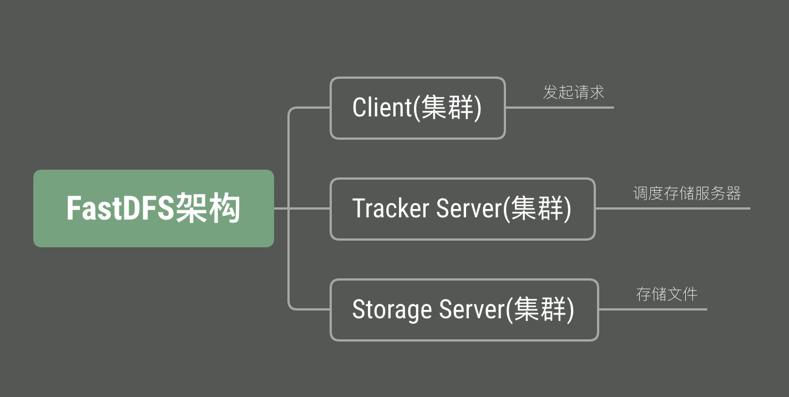

FastDFS 是用 C语言 编写的一款开源的轻量级开源的分布式文件系统。





Python 中使用fastDFS

1. 安装客户端扩展包

   ```bash
   $ pip3 install fdfs_client-py-master.zip
   $ pip3 install mutagen
   $ pip3 install requests
   ```

2. 配置文件

   把 [client.conf](./client.conf) 文件复制到项目中去。

   根据自己的需求修改里面的`tracker_server` 和 `base_path` 。

3. 使用