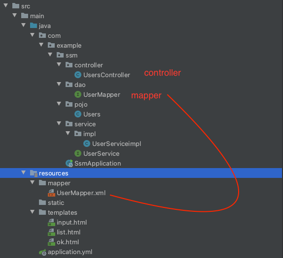
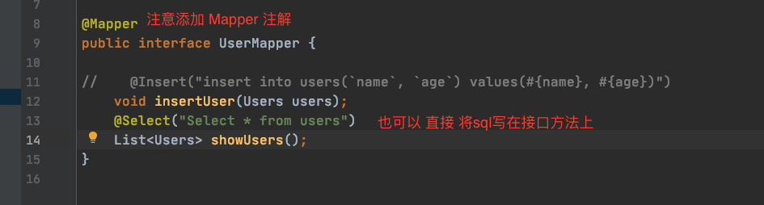
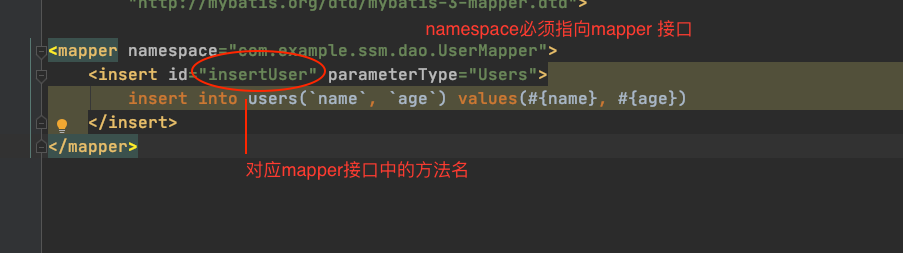

## SpringBoot核心注解

1. `@SpringBootApplication`  -- SpringBoot的启动类。

2. `@SpringBootConfiguration` --  通过Bean对象获取配置信息 

3. `@Configuration` --表示为一个配置类， 通过对bean对象的操作来替代spring中的xml文件。

   ```java
   @Configuration(proxyBeanMethods = true)
   // proxyBeanMethods为true时，表示所有获取的bean都是bean容器中的组件。为false时，表示每次获取的bean实例都是不一样的
   public class MyConfig {
   
       @Bean
       public User user1(){
           return new User("zhangsan", 18);
       }
   }
   ```

   

4. `@EnableAutoConfiguration` -- 自动配置功能的注解，完成一些初始化环境的配置。

5. `@ComponentScan` -- 完成spring的组件扫描。替代之前我们在xml文件中配置组件扫描的配置<context:component-scan pacage="...">

6. @ConfigurationProperties --- 配置绑定

   ```xml
   <!-- application.properties文件 -->
   my.car=BYD
   my.price=111111
   ```

   ```java
   @Component//只有在容器中的组件，才能拥有springboot提供的配置绑定功能。
   @ConfigurationProperties(prefix="my")
   public class Car{
     private String car;
     private Integer price;
     //省略getter,setter。。。。。。
   }
   ```

   

7. 

## Springboot 整合 servlet


## Springboot 整合 Filter


## Springboot 整合 Listener


## Springboot 访问静态资源

1. SpringBoot 从 `classpath/static` 目录下寻找

   目录名称必须是 `static`

   

2. `ServletContext` 根目录下

   在 `src/main/webapp` 目录下， 目录名称为`webapp`


## Springboot 整合 jsp

1. 在pom.xml

```xml
  <dependencies>
	  <dependency>
	  	<groupId>org.springframework.boot</groupId>
	  	<artifactId>spring-boot-starter-web</artifactId>
	  </dependency>
	  <dependency>
	  	<groupId>javax.servlet</groupId>
	  	<artifactId>jstl</artifactId>
	  </dependency>
	  <dependency>
	  	<groupId>org.apache.tomcat.embed</groupId>
	  	<artifactId>tomcat-embed-jasper</artifactId>
	  	<scope>provided</scope>
	  </dependency>
  </dependencies>
```

2. 在 application.properties

   ```properties
   spring.mvc.view.prefix=/WEB-INF/jsp/
   spring.mvc.view.suffix=.jsp
   ```

3. 创建jsp页面

   需在`src/main/WEB-INF/jsp` 添加jsp页面 


## Springboot 整合 freemarker

1. ```xml
   <dependency>
               <groupId>org.springframework.boot</groupId>
               <artifactId>spring-boot-starter</artifactId>
           </dependency>
           <dependency>
               <groupId>org.springframework.boot</groupId>
               <artifactId>spring-boot-starter-freemarker</artifactId>
           </dependency>
           <dependency>
   ```

2. 在 application.properties

   ```properties
   spring.freemarker.charset=UTF-8
   spring.freemarker.suffix=.ftl
   spring.freemarker.content-type=text/html; charset=utf-8
   spring.freemarker.template-loader-path=classpath:/templates
   ```

3. 创建视图、创建Controller


## Springboot 整合 thymeleaf


## Springboot整合RabbitMQ

```xml
<dependency>
  <groupId>org.springframework.boot</groupId>
  <artifactId>spring-boot-starter-amqp</artifactId>
</dependency>
```

```yaml
spring:
  application:
    name: springcloud-mq

  rabbitmq:
    host: 192.168.0.152
    port: 5672
    username: admin
    password: 123456
```

```java
//1. 创建消息队列
@Configuration
public class QueueConfig {

    /**
     * 创建队列
     * @return
     */
    @Bean
    public Queue createQueue(){
        return new Queue("Hello-Queue");
    }
}
```

```java
/**
 * 消息发送者
 */
@Component
public class Sender {

    @Autowired
    private AmqpTemplate rabbitAmqpTemplate;

    /**
     * 发送消息的方法
     * @param msg
     */
    public void send(String msg){

      	//第一个参数为消息队列名称，第二个参数为消息
        this.rabbitAmqpTemplate.convertAndSend("Hello-Queue", msg);
    }

}
```

```java
/**
 * 消息接收者
 */
@Component
public class Receiver {

    /**
     * 接收消息的方法。采用消息队列监听机制
     * @param msg
     */
    @RabbitListener(queues = "Hello-Queue")
    public void process(String msg){
        System.out.println(msg);
    }
}
```


## Springboot 整合springmvc + mybatis



1. `pom.xml`

   ```xml
   <dependency>
     <groupId>org.springframework.boot</groupId>
     <artifactId>spring-boot-starter-web</artifactId>
   </dependency>
   <dependency>
     <groupId>org.springframework.boot</groupId>
     <artifactId>spring-boot-starter-thymeleaf</artifactId>
   </dependency>
   <dependency>
     <groupId>org.mybatis.spring.boot</groupId>
     <artifactId>mybatis-spring-boot-starter</artifactId>
     <version>2.1.4</version>
   </dependency>
   <dependency>
     <groupId>mysql</groupId>
     <artifactId>mysql-connector-java</artifactId>
   </dependency>
   <!-- https://mvnrepository.com/artifact/com.alibaba/druid -->
   <dependency>
     <groupId>com.alibaba</groupId>
     <artifactId>druid</artifactId>
     <version>1.2.4</version>
   </dependency>
   ```

2. `application.properties`

   ```properties
   spring.datasource.driver-class-name=com.mysql.cj.jdbc.Driver
   spring.datasource.url=jdbc:mysql://localhost:3307/web_data
   spring.datasource.username=root
   spring.datasource.password=root
   
   spring.datasource.type= com.alibaba.druid.pool.DruidDataSource 
   mybatis.type-aliases-package=com.example.ssm.pojo
   ```

   ```yaml
   spring:
     datasource:
       driver-class-name: com.mysql.cj.jdbc.Driver
       url: jdbc:mysql://localhost:3306/web_data
       username: root
       password: root
       type: com.alibaba.druid.pool.DruidDataSource
     freemarker:
       charset: UTF-8
       suffix: .ftl
       content-type: text/html;charset=utf-8
       template-loader-path: classpath:/templates
   
   mybatis:
     mapper-locations: classpath*:mapper/*.xml
     type-aliases-package: com.example.ssm.pojo
   ```

3. 定义Mapper xml 并将它们放到 `src/main/resources/mapper`文件下 ，并对应 `application.properties` 或`application.yml` 中的 `mybatis.mapper-locations: classpath*:mapper/*.xml` 。

   ```xml
   <mapper namespace="com.example.ssm.dao.UserMapper">
       <insert id="insertUser" parameterType="Users">
           insert into users(`name`, `age`) values(#{name}, #{age})
       </insert>
   </mapper>
   ```

   

   

   在`dao`文件夹下面定义 与`xml`文件对应的`interface`文件，名称 必须是一致。

   

4. 定义`service`层。

   ```java
   public interface UserService {
       void addUser(Users users);
       List<Users> userlist();
   }
   ```

   ```java
   @Service("userService")
   public class UserServiceimpl implements UserService {
   
       @Autowired
       private UserMapper userMapper;
   
       @Override
       public void addUser(Users users) {
           this.userMapper.insertUser(users);
       }
   
       @Override
       public List<Users> userlist() {
           return userMapper.showUsers();
       }
   }
   ```

5. 程序的入口类中：

   ```java
   @SpringBootApplication
   @MapperScan("com.example.ssm.dao") //用来告诉springboot去哪扫描mapper
   public class SsmApplication {
   
       public static void main(String[] args) {
           SpringApplication.run(SsmApplication.class, args);
       }
   
   }
   ```

   

## springboot 表单数据校验

```xml
<dependency>
  <groupId>org.springframework.boot</groupId>
  <artifactId>spring-boot-starter-validation</artifactId>
</dependency>
```


## Springboot异常处理

### 1. 自定义错误页面

springboot默认提供了一套处理异常的机制。一旦程序出现了异常，它会向 `/error` 的url发送请求。  springboot提供 了一个叫`BasicExceptionController` 来处理 `/error`请求。

如果需要将所有的异常统一跳转到自定义 的错误 页面，需要在`src/main/resources/templates`目录下创建一个`error.html`的页面。名称必须为`error.html`。其实就是自定义一个错误页面来替换了springboot提供 的默认错误页面。

### 2. `@ExceptionHandler` 注解处理异常

```java
    /**
     * 这个方法的作用：处理NullPointException异常，其他的异常不管
     * @param exception 
     * @return
     */
    @ExceptionHandler(value = {java.lang.NullPointerException.class})
    public ModelAndView nullPointerExceptionHandler(Exception exception){
        ModelAndView mv = new ModelAndView();
        mv.addObject("error", exception.toString());
        mv.setViewName("nullpoint_error");//页面名称
        return mv;
    }
```

### 3. `@ExceptionHandler` + `@ControllerAdvice` 注解处理异常

```java
//定义一个全局的异常处理类， 在该类上添加 @ControllerAdvice 注解
@ControllerAdvice
public class GlobaException {
    /**
     * 这个方法的作用：处理NullPointException异常，其他的异常不管
     * @param exception
     * @return
     */
    @ExceptionHandler(value = {java.lang.NullPointerException.class})
    public ModelAndView nullPointerExceptionHandler(Exception exception){
        ModelAndView mv = new ModelAndView();
        mv.addObject("error", exception.toString());
        mv.setViewName("nullpoint_error");
        return mv;
    }
  
  	@ResponseBody
  	@ExceptionHandler(value=java.lang.Exception.class)
  	public Map<String, Object> myException(Exception ex){
      Map<String, Object> map = new HashMap<>();
      map.put("code", 500);
      map.put("msg", "Error");
      return map;
    }
}
```

### 4. 配置`SimpleMappingExceptionResolver` 处理异常

```java
/**
 * 通过 SimpleMappingExceptionResolver 处理全局异常
 * 但这种方式没法把Exception信息传递给页面
 */
@Configuration
public class GlobalException {

    @Bean
    public SimpleMappingExceptionResolver getSimpleMappingExceptionResolver(){
        SimpleMappingExceptionResolver resolver = new SimpleMappingExceptionResolver();

        Properties properties = new Properties();

        /**
         * 参数1： 异常类型，必须是异常类型的全名
         * 参数2： 视图名称
         */
        properties.put("java.lang.ArithmeticException", "error1");
        properties.put("java.lang.NullPointException", "error1");

        return resolver;
    }
}
```

### 5. 自定义`HandlerExceptionResolver` 处理异常

```java
//定义一个全局的异常处理类，并实现 HandlerExceptionResolver 接口
/**
 * 通过 HandlerExceptionResolver 处理全局异常
 */
@Configuration
public class GlobalException implements HandlerExceptionResolver {
    
    @Override
    public ModelAndView resolveException(HttpServletRequest request, HttpServletResponse response, Object handler, Exception ex) {
        ModelAndView mv = new ModelAndView();
        //判断不同类型的异常，跳转到不同的错误页面
        if (ex instanceof ArithmeticException){
            mv.setViewName("error1");
        }
        if (ex instanceof NullPointerException){
            mv.setViewName("error2");
        }

        mv.addObject("error", ex.toString());
        return mv;
    }
}

```


## springboot整合 Junit单元测试

```xml
<dependency>
  <groupId>org.springframework.boot</groupId>
  <artifactId>spring-boot-starter-test</artifactId>
  <scope>test</scope>
</dependency>
<dependency>
  <groupId>junit</groupId>
  <artifactId>junit</artifactId>
  <scope>test</scope>
</dependency>
```

```java
@RunWith(SpringJUnit4ClassRunner.class) // 表示junit与spring环境进行整合
@SpringBootTest(classes = {SsmApplication.class}) //加载springboot启动类
public class UserServiceTest {

    @Autowired
    private UserService userService;

    @Test
    public void testAddUser(){
        this.userService.addUser(new Users("aaaaa", 234));
    }
}
```


## SpringBoot 热部署

DevTools工具


## SpringBoot 缓存技术

### 1. springboot整合Ehcache

```xml
<!--        Spring Boot缓存支持启动器-->
        <dependency>
            <groupId>org.springframework.boot</groupId>
            <artifactId>spring-boot-starter-cache</artifactId>
        </dependency>
<!--        Ehcache-->
        <dependency>
            <groupId>org.ehcache</groupId>
            <artifactId>ehcache</artifactId>
            <version>3.8.1</version>
        </dependency>
        <dependency>
            <groupId>javax.cache</groupId>
            <artifactId>cache-api</artifactId>
        </dependency>
```

待完善……

### 2. springboot 整合 spring data redis

```xml
<dependency>
  <groupId>org.springframework.boot</groupId>
  <artifactId>spring-boot-starter-data-redis</artifactId>
</dependency>
<dependency>
  <groupId>redis.clients</groupId>
  <artifactId>jedis</artifactId>
  <version>3.4.1</version>
  <type>jar</type>
  <scope>compile</scope>
</dependency>
```

```yaml
spring: 
  redis:
    database: 0
    host: 127.0.0.1
    port: 6379
    password: ""
    jedis:
      pool:
        max-active: 8
        max-idle: 10
        min-idle: 0
        max-wait: -1
```

```java
@Configuration
public class RedisConfig {

//    @Value("${spring.redis.database}")
//    private int database;
//    @Value("${spring.redis.host}")
//    private String host;
//    @Value("${spring.redis.port}")
//    private int port;
//    @Value("${spring.redis.password}")
//    private String password;
//    @Value("${spring.redis.timeout}")
//    private int timeout;
//    @Value("${spring.redis.jedis.pool.max-active}")
//    private int maxActive;
//    @Value("${spring.redis.jedis.pool.max-wait}")
//    private long maxWaitMillis;
//    @Value("${spring.redis.jedis.pool.max-idle}")
//    private int maxIdle;
//    @Value("${spring.redis.jedis.pool.min-idle}")
//    private int minIdle;


    /**
     * 1. 创建JedisPoolConfig对象。在该对象中完成一些链接池的配置
     * @return
     */
    @Bean
    @ConfigurationProperties(prefix = "spring.redis.jedis.pool")
    public JedisPoolConfig jedisPoolConfig(){
        JedisPoolConfig config = new JedisPoolConfig();

//        //最大空闲数
//        config.setMaxIdle(maxIdle);
//        //最小空闲数
//        config.setMinIdle(minIdle);
//        //最大连接数
//        config.setMaxTotal(maxActive);
//        // 当池内没有可用连接时，最大等待时间
//        config.setMaxWaitMillis(maxWaitMillis);


        return config;
    }

    /**
     * 2. 创建JedisConnectionFactory,配置redis链接信息
      * @param config
     * @return
     */
    @Bean
    @ConfigurationProperties(prefix = "spring.redis")
    public JedisConnectionFactory jedisConnectionFactory(JedisPoolConfig config){

//        JedisClientConfiguration jedisClientConfiguration = JedisClientConfiguration.builder().usePooling()
//                .poolConfig(config).and().readTimeout(Duration.ofMillis(timeout)).build();
//
//        RedisStandaloneConfiguration redisStandaloneConfiguration = new RedisStandaloneConfiguration();
//        redisStandaloneConfiguration.setHostName(host);
//        redisStandaloneConfiguration.setPort(port);
//        redisStandaloneConfiguration.setDatabase(database);
//        redisStandaloneConfiguration.setPassword(RedisPassword.of(password));
//
//        JedisConnectionFactory factory = new JedisConnectionFactory(redisStandaloneConfiguration, jedisClientConfiguration);

        JedisConnectionFactory factory = new JedisConnectionFactory(config);
        return factory;
    }

    /**
     * 3. 创建RedisTemplate，用于执行Redis操作
     * @param factory
     * @return
     */
    @Bean
    public RedisTemplate<String, Object> redisTemplate(JedisConnectionFactory factory){
        RedisTemplate<String, Object> template = new RedisTemplate<>();
        //关联factory
        template.setConnectionFactory(factory);

        //为key设置序列化器
        template.setKeySerializer(new StringRedisSerializer());

        // 使用Jackson ,将对象序列化为JSON
        Jackson2JsonRedisSerializer jackson2JsonRedisSerializer = new Jackson2JsonRedisSerializer(Object.class);
        //json 转对象类，不设置默认的会将json转成hashmap 报错:java.util.LinkedHashMap cannot be cast to XX
        ObjectMapper om = new ObjectMapper();
        om.setVisibility(PropertyAccessor.ALL, JsonAutoDetect.Visibility.ANY);
        om.activateDefaultTyping(LaissezFaireSubTypeValidator.instance, ObjectMapper.DefaultTyping.NON_FINAL);
        jackson2JsonRedisSerializer.setObjectMapper(om);

        //为value设置序列化器
        template.setValueSerializer(jackson2JsonRedisSerializer);
        template.afterPropertiesSet();


        return template;
    }


    // 缓存管理器
    @Bean
    public RedisCacheManager cacheManager(RedisConnectionFactory jedisConnectionFactory) {
        RedisCacheManager redisCacheManager = RedisCacheManager.builder(jedisConnectionFactory).build();
        return redisCacheManager;
    }
}
```


## springboot 整合 Spring DATA JPA

```xml
<dependency>
  <groupId>mysql</groupId>
  <artifactId>mysql-connector-java</artifactId>
</dependency>
<!-- https://mvnrepository.com/artifact/com.alibaba/druid -->
<dependency>
  <groupId>com.alibaba</groupId>
  <artifactId>druid</artifactId>
  <version>1.2.4</version>
</dependency>
<dependency>
  <groupId>org.springframework.boot</groupId>
  <artifactId>spring-boot-starter-data-jpa</artifactId>
</dependency>
```

```yaml
spring:
  datasource:
    driver-class-name: com.mysql.cj.jdbc.Driver
    url: jdbc:mysql://192.168.0.88:3307/web_data
    username: root
    password: WLzsc@1234
    type: com.alibaba.druid.pool.DruidDataSource
  jpa:
    hibernate:
      ddl-auto: update
    show-sql: true
```

```java
@Entity
@Table(name = "users")
@Data
public class User {
    @Id
    @GeneratedValue(strategy = GenerationType.IDENTITY)
    @Column(name = "id")
    private Integer id;
    @Column(name = "name")
    private String name;
    @Column(name = "age")
    private Integer age;
}
```

```java
public interface UsersRepository extends JpaRepository<User, Integer> {
}
```

```java
@Autowired
private UsersRepository usersRepository;

@Test
public void testGetUsers(){
  List<User> users = usersRepository.findAll();
  System.out.println(users);
}
```


### `Spring DATA JPA`核心接口：

#### `Repository`

- ​	提供了方法名称命名查询 方式 

  ```java
  public interface UserRepositoryByName extends Repository<User, Integer> {
      //方法的名称必须要遵循驼峰式命名规则 ： findBy + 属性名称(首字母要大写) + 查询条件(首字母大写)
      List<User> findByName(String name);
  
      List<User> findByNameAndAge(String name, Integer age);
  
      List<User> findByNameLike(String name);
  }
  ```

- ​	提供了基于@Query注解查询与更新

  ```java
  public interface UserRepositoryQueryAnnotation extends Repository<User, Integer> {
  
      @Query("from User where name = ?1") //HQL时，使用对象类型
      List<User> queryByNameUseHQL(String name);
  
      @Query(value = "select * from users where name = :name ", nativeQuery = true)
      List<User> queryByNameUseSQL(@Param("name") String name);
  
      @Query(value = "select * from users where name = ?1 ", nativeQuery = true)
      List<User> queryByNameUse(String name);
  
  
      @Transactional // 更新操作需要在事务中进行
      @Modifying //真正用来执行更新操作的注解
      @Query(value = "update users set name = ?1 where id=?2", nativeQuery = true)
      void updateUserNameById(String name, Integer id);
  }
  ```

  

#### `CrudRepository`

​	`CrudRepository` 接口，主要是完成一些增删改查的操作。它继承了`Repository`接口

#### `PagingAndSortingRepository`

​	分页与排序，它继承了`CrudRepository`接口

```java
//排序
@Autowired
private UserRepositoryPagingAndSortingRepository pagingAndSortingRepository;

@Test
public void testPagingAndSortingRepository(){
  Sort.Order order = new Sort.Order(Sort.Direction.DESC, "id");
  Sort.Order order2 = new Sort.Order(Sort.Direction.ASC, "name");

  Sort sort = Sort.by(order, order2);
  List<User> userList = (List<User>) this.pagingAndSortingRepository.findAll(sort);
  for (User user:
       userList) {
    System.out.println(user);
  }
}
```

```java
//分页 + 排序 
@Test
public void testPagingAndSortingRepository(){
  Sort.Order order = new Sort.Order(Sort.Direction.DESC, "name");
  //
  Sort sort = Sort.by(order);
  Pageable pageable = PageRequest.of(0, 2, sort); //页码从0开始
  // Pageable pageable = PageRequest.of(0, 2); //页码从0开始

  Page<User> page = this.pagingAndSortingRepository.findAll(pageable);
  System.out.println(page.getTotalElements()); //总条数
  System.out.println(page.getTotalPages()); //总页数
  List<User> users = page.getContent(); // 分页后的数据
  for (User user :
       users) {
    System.out.println(user);
  }
}
```


#### `JpaRepository`

​	它继承了`PagingAndSortingRepository`接口。对继承的父接口中的方法的返回值进行适配。

```java
@Test
public void testJpaRepository(){
  Sort.Order order = new Sort.Order(Sort.Direction.DESC, "name");
  //
  Sort sort = Sort.by(order); 

  List<User> users = this.usersRepository.findAll(sort);
  for (User user :
       users) {
    System.out.println(user);
  }
}
```


#### `JPASpecificationExecutor`

主要提供了多条件查询的支持，并且可以在查询中添加分页和排序。

它是单独存在的。并没有继承自上面的任何接口。

```java
//单条件查询 
@Test
public void testJpaSpecificationExecutor(){
  /**
         * 用于封闭查询条件
         */
  Specification<User> specification = new Specification<User>() {

    /**
             *
             * @param root 查询对象的属性的封装
             * @param query 封装要执行的查询中的各个部分的信息，如，select ,from, order by等
             * @param criteriaBuilder 查询条件的构造器
             * @return Predicate 单个的查询条件
             */
    @Override
    public Predicate toPredicate(Root<User> root, CriteriaQuery<?> query, CriteriaBuilder criteriaBuilder) {
      // WHERE name = '万有引力'
      Predicate predicate = criteriaBuilder.equal(root.get("name"), "万有引力");
      return predicate;
    }
  };

  List<User> userList = this.userRepositorySpe.findAll(specification);

  for (User user :
       userList) {
    System.out.println(user);
  }
}
```

```java
//多条件查询 
@Test
public void testJpaSpecificationExecutor(){
  /**
         * 用于封闭查询条件
         */
  Specification<User> specification = new Specification<User>() {

    /**
             *
             * @param root 查询对象的属性的封装
             * @param query 封装要执行的查询中的各个部分的信息，如，select ,from, order by等
             * @param criteriaBuilder 查询条件的构造器
             * @return Predicate 单个的查询条件
             */
    @Override
    public Predicate toPredicate(Root<User> root, CriteriaQuery<?> query, CriteriaBuilder criteriaBuilder) { 
      return criteriaBuilder.and(
        criteriaBuilder.equal(root.get("name"), "万有引力"),
        criteriaBuilder.equal(root.get("age"), 18)
      );
    }
  };

  //排序
  Sort.Order order = new Sort.Order(Sort.Direction.DESC, "name");
  Sort sort = Sort.by(order);

  List<User> userList = this.userRepositorySpe.findAll(specification, sort);

  for (User user :
       userList) {
    System.out.println(user);
  }
}
```


### 关联映射操作

#### 1. 一对多的关联关系

#### 2. 多对多的关联关系


## SpringBoot定时任务

### 1. Scheduled 定时任务器 

Spring 3.0以后自带的一个定时任务器

```xml
<dependency>
  <groupId>org.springframework</groupId>
  <artifactId>spring-context-support</artifactId>
</dependency>
```

```java
@Component
public class ScheduledDemo {

    /**
     * 定时任务方法
     */
    @Scheduled(cron = "")
    public void scheduledMethod(){
        System.out.println(new Date());
    }
}
```

```java
@SpringBootApplication
@MapperScan("com.example.ssm.dao")
@EnableScheduling //开启Schedule定时任务
public class SsmApplication {
    public static void main(String[] args) {
        SpringApplication.run(SsmApplication.class, args);
    }
}
```


### 2. Quartz 

Quartz的使用思路：

1. job -- 任务， 要做什么事
2. Trigger -- 触发器，什么时候去做
3. Scheduler -- 任务高度  ,什么时候需要去做什么


```xml
<dependencies>
  <dependency>
    <groupId>org.quartz-scheduler</groupId>
    <artifactId>quartz</artifactId>
    <version>2.3.2</version>
  </dependency>
</dependencies>
```

```java
public class QuartzJob implements Job {

    /**
     * 任务被触发时，执行的方法
     * @param jobExecutionContext
     * @throws JobExecutionException
     */
    public void execute(JobExecutionContext jobExecutionContext) throws JobExecutionException {
        System.out.println("Execute... " + new Date());
    }
}
```

```java
public class qMain {
    public static void main(String[] args) throws SchedulerException {
        // 1. 创建Job对象, 做什么事
        JobDetail jobDetail = JobBuilder.newJob(QuartzJob.class).build();

        /**
         * 1. 简单的trigger触发时间： 通过Quartz提供的一个方法来完成简单的重复调
         * 2. cron Trigger: 按照cron的表达式来给定触发的时间
         */
        // 2. 创建 Trigger对象， 在什么时候做
       //  Trigger trigger = TriggerBuilder.newTrigger().withSchedule(SimpleScheduleBuilder.repeatSecondlyForever()).build();
      Trigger trigger = TriggerBuilder.newTrigger().withSchedule(CronScheduleBuilder.cronSchedule("")).build();

        //3. 创建 Scheduler对象
        Scheduler scheduler = StdSchedulerFactory.getDefaultScheduler();
        scheduler.scheduleJob(jobDetail, trigger);

        //启动
        scheduler.start();
    }
}
```


#### springboot整合Quartz

1. Simple Trigger方式 ：

   ```xml
   <dependency>
     <groupId>org.springframework.boot</groupId>
     <artifactId>spring-boot-starter-web</artifactId>
   </dependency>
   <dependency>
     <groupId>org.springframework.boot</groupId>
     <artifactId>spring-boot-starter-quartz</artifactId>
   </dependency>
   ```

   ```java
   /**
    * Quartz 配置类
    * Simple
    */
   @Configuration
   public class QuartzSimpleConfig {
   
       /**
        * 1. 关联Job
        * @return
        */
       @Bean
       public JobDetailFactoryBean jobDetailFactoryBean(){
           JobDetailFactoryBean factoryBean = new JobDetailFactoryBean();
   
           //关联Job类
           factoryBean.setJobClass(QuartzJob.class);
   
           return factoryBean;
       }
   
       /**
        * 2. 创建simple trigger对象
        * @param jobDetailFactoryBean
        * @return
        */
       @Bean
       public SimpleTriggerFactoryBean simpleTriggerFactoryBean(JobDetailFactoryBean jobDetailFactoryBean){
           SimpleTriggerFactoryBean bean = new SimpleTriggerFactoryBean();
           //关联 JobDetail
           bean.setJobDetail(jobDetailFactoryBean.getObject());
   
           bean.setRepeatInterval(2000);//执行的毫秒数
           bean.setRepeatCount(5); //表示重复5次
           return bean;
       }
   
       /**
        * 3. 创建 Scheduler对象
        * @param simpleTriggerFactoryBean
        * @return
        */
       @Bean
       public SchedulerFactoryBean schedulerFactoryBean(SimpleTriggerFactoryBean simpleTriggerFactoryBean){
           SchedulerFactoryBean factoryBean = new SchedulerFactoryBean();
           //关联 Trigger
           factoryBean.setTriggers(simpleTriggerFactoryBean.getObject());
           return factoryBean;
       }
   
   }
   ```

   ```java
   @SpringBootApplication
   @EnableScheduling
   public class Demo4Application {
   
       public static void main(String[] args) {
           SpringApplication.run(Demo4Application.class, args);
       }
   
   }
   ```

   

2. cron Trigger方式

   ```xml
   <dependency>
     <groupId>org.springframework.boot</groupId>
     <artifactId>spring-boot-starter-web</artifactId>
   </dependency>
   <dependency>
     <groupId>org.springframework.boot</groupId>
     <artifactId>spring-boot-starter-quartz</artifactId>
   </dependency>
   ```

   ```java
   /**
    * Quartz 配置类
    * cron trigger
    */
   @Configuration
   public class QuartzCronConfig {
   
       /**
        * 1. 关联Job
        * @return
        */
       @Bean
       public JobDetailFactoryBean jobDetailFactoryBean(){
           JobDetailFactoryBean factoryBean = new JobDetailFactoryBean();
   
           //关联Job类
           factoryBean.setJobClass(QuartzJob.class);
   
           return factoryBean;
       }
   
       /**
        * 2. cron trigger
        * @param jobDetailFactoryBean
        * @return
        */
       @Bean
       public CronTriggerFactoryBean cronTriggerFactoryBean(JobDetailFactoryBean jobDetailFactoryBean){
           CronTriggerFactoryBean factoryBean = new CronTriggerFactoryBean();
           //关联Jobdetail
           factoryBean.setJobDetail(jobDetailFactoryBean.getObject());
           //设置cron表达式
           factoryBean.setCronExpression("0/2 * * * * ?");
   
           return factoryBean;
       }
   
       /**
        * 3. 创建 Scheduler对象
        * @param cronTriggerFactoryBean
        * @return
        */
       @Bean
       public SchedulerFactoryBean schedulerFactoryBean(CronTriggerFactoryBean cronTriggerFactoryBean){
           SchedulerFactoryBean factoryBean = new SchedulerFactoryBean();
           //关联 Trigger
           factoryBean.setTriggers(cronTriggerFactoryBean.getObject());
           return factoryBean;
       }
   
   }
   ```

   ```java
   @SpringBootApplication
   @EnableScheduling
   public class Demo4Application {
   
       public static void main(String[] args) {
           SpringApplication.run(Demo4Application.class, args);
       }
   
   }
   ```

3. Job类中注入业务逻辑功能

   ```java
   @Service
   public class UserService {
       public void addUsers(){
           System.out.println("add Users ......");
       }
   }
   ```

   ```java
   /**
    * Job 对象类
    */
   public class QuartzJob implements Job {
   
       /**
        * 将业务实现类注入进来
        */
       @Autowired
       private UserService userService;
   
       @Override
       public void execute(JobExecutionContext jobExecutionContext) throws JobExecutionException {
           System.out.println(new Date());
         	//执行spring boot业务逻辑中的代码
         	this.userService.addUsers();
       }
   }
   ```

   **主要是要自定义一个继承自`AdaptableJobFactory` 的类，用于手动将JobFactory添加到 spring ioc容器中，并完成 对象属性的注入，如完成 UserService 的注入。**

   ```java
   
   /**
    * 用来手动完成对象的注入
    */
   @Component("myAdaptableJobFactory")
   public class MyAdaptableJobFactory extends AdaptableJobFactory {
   
       /**
        * AutowireCapableBeanFactory 可以将一个对象手动添加到spring ioc容器中，并完成 该对象的属性注入
        */
       @Autowired
       private AutowireCapableBeanFactory autowireCapableBeanFactory;
   
       /**
        * 将实例类的任务对象手动添加到spring ioc容器中，并完成对象的注入
        * @param bundle
        * @return
        * @throws Exception
        */
       @Override
       protected Object createJobInstance(TriggerFiredBundle bundle) throws Exception {
           Object obj = super.createJobInstance(bundle);
   
           //将 obj 对象 添加到 spring ioc容器中，并完成obj中的属性的注入
           this.autowireCapableBeanFactory.autowireBean(obj);
   
           return  obj;
       }
   }
   ```

   ```java
   /**
    * Quartz 配置类
    */
   @Configuration
   public class QuartzConfig {
   
       /**
        * 1. 创建JobDetail
        * @return
        */
       @Bean
       public JobDetailFactoryBean jobDetailFactoryBean(){
           JobDetailFactoryBean factoryBean = new JobDetailFactoryBean();
   
           //关联Job类
           factoryBean.setJobClass(QuartzJob.class);
   
           return factoryBean;
       }
   
       /**
        * 2. 创建 trigger
        * @param jobDetailFactoryBean
        * @return
        */
     	@Bean
       public CronTriggerFactoryBean cronTriggerFactoryBean(JobDetailFactoryBean jobDetailFactoryBean){
           CronTriggerFactoryBean factoryBean = new CronTriggerFactoryBean();
           //关联JobDetail
           factoryBean.setJobDetail(jobDetailFactoryBean.getObject());
           //设置cron
           factoryBean.setCronExpression("0/2 * * * * ?");
   
           return factoryBean;
       }
   
       /**
        * 3. 创建 Scheduler对象
        * @param cronTriggerFactoryBean
        * @param myAdaptableJobFactory
        * @return
        */
     	@Bean
       public SchedulerFactoryBean schedulerFactoryBean(CronTriggerFactoryBean cronTriggerFactoryBean,
                                                        MyAdaptableJobFactory myAdaptableJobFactory){
   
           SchedulerFactoryBean factoryBean = new SchedulerFactoryBean();
   
           //关联trigger
           factoryBean.setTriggers(cronTriggerFactoryBean.getObject());
   
           //实例化自定义的JobFactory类
           factoryBean.setJobFactory(myAdaptableJobFactory);
   
           return factoryBean;
       }
   }
   ```

   ```java
   @SpringBootApplication
   @EnableScheduling
   public class DemoApplication {
       public static void main(String[] args) {
           SpringApplication.run(DemoApplication.class, args);
       }
   }
   ```

   

## 使用spring-boot-admin监控spring boot应用

具体配置：https://github.com/codecentric/spring-boot-admin


## yaml  配置文件智能提示 设置

```xml
<dependency>
    <groupId>org.springframework.boot</groupId>
    <artifactId>spring-boot-configuration-processor</artifactId>
    <optional>true</optional>
</dependency>

 
<build>
  <plugins>
    <plugin>
      <groupId>org.springframework.boot</groupId>
      <artifactId>spring-boot-maven-plugin</artifactId>
      <configuration>
        <excludes> <!--打包的时候将智能提示依赖排除在打包之中-->
          <exclude>
            <groupId>org.springframework.boot</groupId>
            <artifactId>spring-boot-configuration-processor</artifactId>
          </exclude>
        </excludes>
      </configuration>
    </plugin>
  </plugins>
</build> 
```

  


