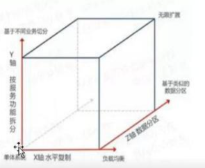

## 如何设计微服务以及设计原则

### 1. AKF拆分原则

AKF扩展立方体：

- Y轴（功能）-- 关注应用中功能划分，基于不同的业务拆分。

  ​	*Y轴扩展会将庞大的整体应用拆分为多个服务。每个服务实现一组相关的功能，如订单管理、客户管理等。在工程上常见的方案是服务化架构(SOA)。*

- X轴（水平扩展） -- 关注水平扩展，也就是“加机器解决问题”。

  ​	*通过绝对平等地复制服务与数据，以解决容量和可用性的问题。其实就是将微服务运行多个实例，做集群加负载均衡的模式。*

- Z轴（数据分区） -- 关注服务和数据的优先级划分，如按地域划分等。

  ​	*Z轴扩展通常是指基于请求者或用户独特的需求，进行系统划分，并使得划分出来的子系统是相互隔离但又是完整的。*

  ​	工程领域常见的 **Z轴** 扩展的两种方案：

  ​	1.单元化架构

  ​	2.数据分区	

  ​		*数据类型（如：业务类型）*

  ​		*数据范围（如：时间段、用户ID）*

  ​		*数据热度（如：用户活跃度，商品热度）*

  ​		*按读写分（如：商品描述，商品库存）*

  ​	

**微服务拆分要点**：

- 低耦合，高内聚：一个服务完成一个独立的功能。
- 按团队结构，小规模团队维护，快速迭代。

### 2. 前后端分离原则

### 3. 无状态服务

### 4. RestFul的通信风格

## RabbitMQ

