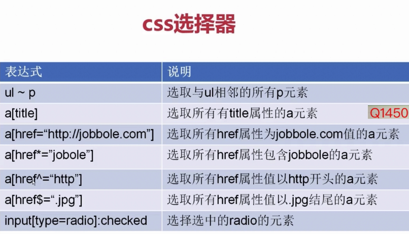

## 部署

+ 安装 scrapyd
```bash
pip install scrapyd
pip install scrapyd-client # 上传工具(scrapyd-client)
```

+ 发布
    1) 拷贝scrapyd-deploy到爬虫目录下

    2) 修改爬虫的scapy.cfg文件

        1、去掉url前的注释符号，这里url就是你的scrapyd服务器的网址； 

        2、deploy:127表示把爬虫发布到名为127的爬虫服务器上，deploy:后的名字可以自己定义；
    
    3) 上传scrapy到scrapyd


## 保存数据到文件
可以使用 `JSON Lines` 格式 进行 保存 ， `JSON Lines` 格式会按“流”的方式进行数据保存。
```bash
scrapy crawl quotes -o quotes.jl # 这样能保证每次启动时的数据会往文件后面添加 ，也不会覆盖文件重新添加。
```

## 给爬虫传参数
通过在命令后面跟上一个 `-a` ，再加上需要传入的参数即可。如果此方法传入的参数，会在爬虫执行 `__init__` 方法时传入到实例中。
```bash
scrapy crawl quotes -o quotes-humor.json -a tag=humor # 此处传入了参数名为tag ，值为humor的参数
```
传入的参数可以像如下使用方式进行：
```python
def start_requests(self):
    url = 'http://quotes.toscrape.com/'
    tag = getattr(self, 'tag', None) # 此处在进行传入参数的获取
    if tag is not None:
        url = url + 'tag/' + tag
    yield scrapy.Request(url, self.parse)
```

## 算法：
深度优先算法-> 递归

广度优先算法-> 队列

# 
+ `response.follow()` 

follow() 方法返回一个`Request`实例，使用时，直接提供相对路径即可。
```python
if next_page is not None:
    # next_page = response.urljoin(next_page)
    # print(next_page)
    # yield scrapy.Request(next_page, callback=self.parse)
    # 下面是替换方法，更简单
    yield response.follow(next_page, callback=self.parse)
```

```python
# 对于“a“ ，在使用follow()时，会自动使用它的 href 属性。
for a in response.css("li.next a"):
    yield response.follow(a, callback=self.parse)
```
#


# css 选择器


