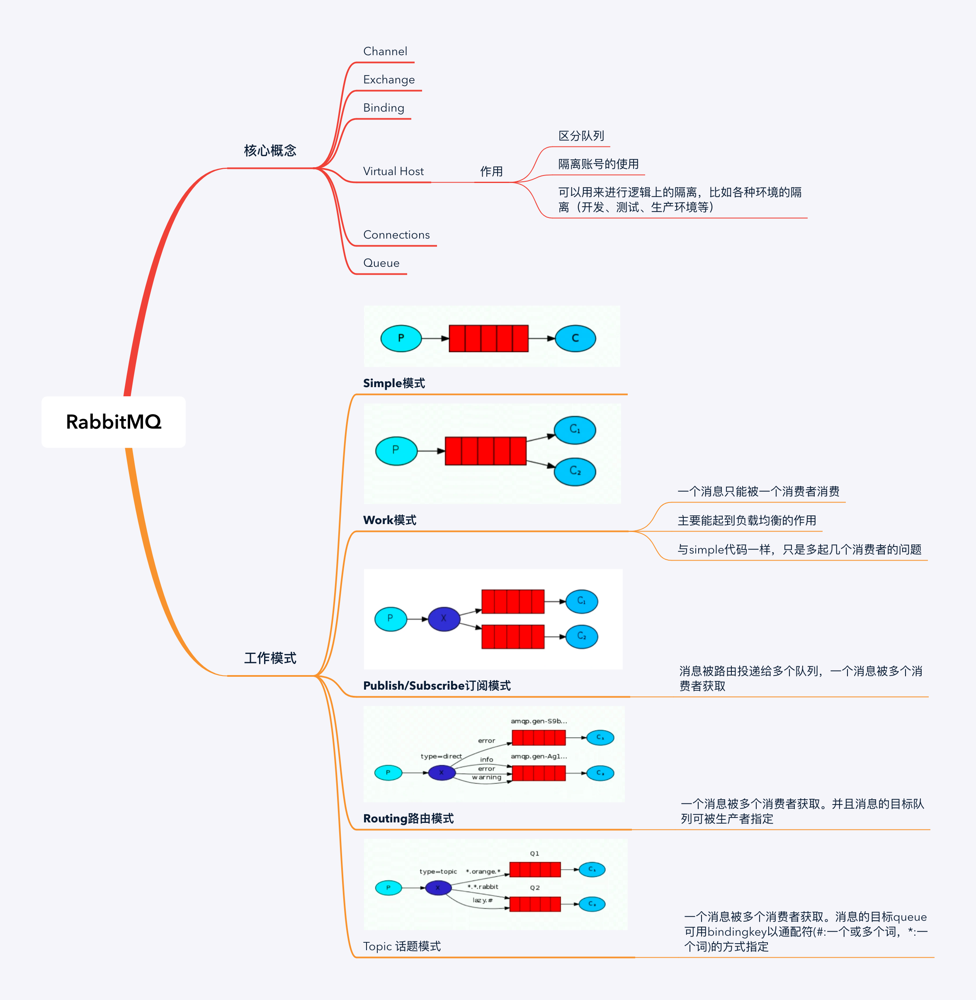

## 安装和配置RabbitMQ

1. 安装Erlang

   ```bash
   sudo apt-get install erlang-nox
   ```

2. 安装RabbitMQ

   ```bash
   sudo apt-get install rabbitmq-server
   ```

3. 配置Management Plugin插件

   ```bash
   systemctl status rabbitmq-server   #查看状态
   
   rabbitmq-plugins enable rabbitmq_management   # 启用插件
   service rabbitmq-server restart    # 重启
   ```

4. 新建用户

   ```bash
   sudo rabbitmqctl add_user  【用户名】 【密码】
   ```

5. 赋予权限

   ```bash
   sudo rabbitmqctl set_user_tags [用户名] administrator
   ```

6. 赋予virtual host中所有资源的配置、写、读权限以便管理其中的资源，也是添加远程访问权限

   ```bash
   sudo rabbitmqctl  set_permissions -p / [用户名] '.*' '.*' '.*'
   ```

   

