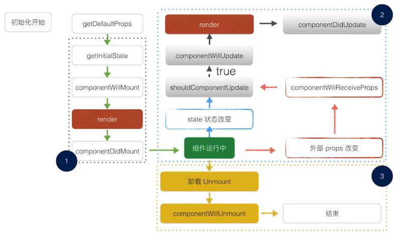

# 问题解决方案
1. ":CFBundleIdentifier", Does Not Exist

    `解决方法：`在创建项目时，指定 `--version` 参数，且值为 `0.44.3`
    ```
    react-native init DemoApp --version 0.44.3
    ```
    

# key word:
- flow 
- flexDirection
- justifyContent
- alignItems

- react-navigation


# 组件的生命周期

*Mounting(装载)*

当组件实例被创建并将其插入 DOM 时，这些方法将被调用：

    constructor()
    componentWillMount()
    render()
    componentDidMount()

*Updating*

改变 props 或 state 可以触发更新事件。 在重新渲染组件时，这些方法将被调用：

    componentWillReceiveProps(nextProps)
    shouldComponentUpdate(nextProps, nextState)
    componentWillUpdate()
    render()
    componentDidUpdate()

*Unmounting(卸载)*

当一个组件从 DOM 中删除时，这个方法将被调用：

    componentWillUnmount()